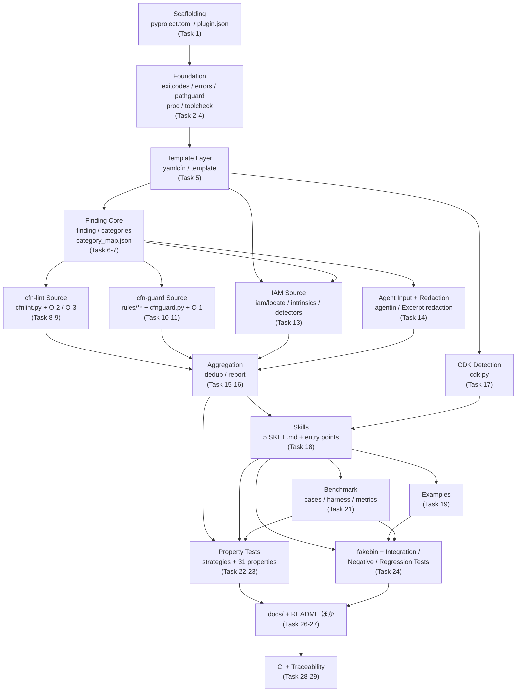

# Implementation Plan: aws-iac-review-agent-plugin

## Overview

design.md の Directory Structure に列挙された全ファイルを、依存関係の下位から順に実装する。実装言語は Python 3.9 (`from __future__ import annotations` 前提)、runtime 依存は `PyYAML>=6.0` のみ、dev 依存は `pytest` / `pytest-cov` / `hypothesis` に限る (design: Dependency Strategy)。

各タスクは以下 3 点を必ず満たす形で記述している。

- **実装内容**: 作成・変更するファイルと、そこに入る内容
- **完了条件**: 観測可能で検証できる状態
- **Test方法**: テストファイル名と技法、または実行コマンド

各モジュールの unit test は当該モジュールと同一タスクに含む。モジュールは test が通るまで完了しない。design.md の 31 個の Correctness Properties は複数モジュールを横断するため独立したタスク群 (Task 23) とし、`tests/property/strategies.py` の後に配置する。

Task 20 の checkpoint が requirements.md Open Question 1 の **v0.1a 境界** に相当する。そこまでで cfn-lint / cfn-guard / IAM Layer 1 / orchestration / 統一レポート / 5 Skill が揃い、単体で動作する plugin になる。以降 (benchmark, property test 一式, docs 一式) が v0.1b 相当である。

`*` 付きのサブタスクは design が deferrable と扱っているもののみ (`ruff` / `mypy` の CI 統合、benchmark の `--filter-only`、`README.ja.md`)。v0.1 Definition of Done に含まれる作業はすべて必須である。

## Dependency Clusters



## Tasks

- [x] 1. Repository 骨格と依存宣言を作成する
  - [x] 1.1 ディレクトリ骨格、`pyproject.toml`、`.gitignore`、`tests/conftest.py` を作成
    - design の Directory Structure に沿って `iacreview/`、`iacreview/iam/`、`skills/`、`rules/`、`benchmark/`、`examples/`、`tests/`、`docs/` を作成し、`iacreview/__init__.py`、`iacreview/iam/__init__.py`、`benchmark/harness/__init__.py`、`tests/conftest.py` を置く。`tests/fixtures/{valid,invalid,tool_output,security}/` と `tests/{unit,property,integration,negative,regression,fakebin}/` を空ディレクトリ + `.gitkeep` で作成する
    - `pyproject.toml` に design 記載の内容をそのまま置く: `requires-python = ">=3.9"`、`dependencies = ["PyYAML>=6.0"]`、`[project.optional-dependencies] dev = ["pytest>=7.0","pytest-cov>=4.0","hypothesis>=6.0"]`、`[tool.pytest.ini_options] testpaths=["tests"]`、`[tool.coverage.run] source=["iacreview","benchmark/harness"]`。PyPI 配布は行わないため `build-system` は置かない
    - `tests/conftest.py` に plugin root を `sys.path` へ挿入する fixture と、`PLUGIN_ROOT` / `FIXTURES` / `FAKEBIN` 定数を定義する
    - 完了条件: plugin root で `python3 -c "import iacreview"` が成功し、`python3 -m pytest --collect-only` が収集エラーなしで終了する
    - Test方法: `python3 -m pytest --collect-only -q` を実行して exit 0 を確認する
    - _Requirements: 16.3, 16.4, 12.1_
    - _Design: Directory Structure, Dependency Strategy_

  - [x] 1.2 `plugin.json` と manifest 検証テストを作成
    - design の Skill Design 節に示された JSON をそのまま `plugin.json` として置く。top-level field は `$schema`, `name`, `version`, `description`, `author`, `homepage`, `repository`, `license`, `keywords` のみ。`extensions` は置かない。`license` は暫定値 `"Apache-2.0"`
    - `tests/unit/test_manifest.py` を作成し、`plugin.json` が valid JSON であること、`name` が `^[a-z0-9]([a-z0-9._-]*[a-z0-9])?$` に適合し 128 文字以内であること、`version` が semver であること、`keywords` が文字列配列であること、closed schema 外の key (`hooks`, `agents`, `commands`, `mcpServers`, `lspServers`, `extensions`) が存在しないこと、plugin root に `mcp.json` が存在しないこと、repository 内に実行可能 binary (ELF / Mach-O magic を持つファイル) が存在しないことを検証する
    - 完了条件: `test_manifest.py` の全ケースが green
    - Test方法: `python3 -m pytest tests/unit/test_manifest.py -q`
    - _Requirements: 1.1, 1.5, 1.6, 1.7, 10.2, 15.1_
    - _Design: Skill Design (plugin.json), Portability Design_

- [x] 2. Exit code と例外階層を定義する
  - [x] 2.1 `iacreview/exitcodes.py` を作成
    - design の Error Handling 節の exit code 表 (0 `OK`, 1 `UNEXPECTED`, 2 `INVALID_ARGUMENTS`, 3 `INPUT_NOT_FOUND`, 4 `PARSE_FAILURE`, 5 `TOOL_UNAVAILABLE`, 6 `TOOL_EXECUTION_FAILURE`, 7 `PATH_VIOLATION`, 8 `NO_REVIEWABLE_TEMPLATE`) を module 定数として定義し、名称 → 値の `dict` も公開する。Magic Value をコード各所に散らさないため、以降のモジュールは必ずこの定数を参照する
    - 完了条件: 9 個の定数が定義され、値の重複がないことがテストで確認される
    - Test方法: `tests/unit/test_exitcodes.py` に定数値の完全一致 assert と値の一意性 assert を書く
    - _Requirements: 16.8_
    - _Design: Error Handling (Exit code)_

  - [x] 2.2 `iacreview/errors.py` に例外階層と `StructuredError` 生成を実装
    - design の「構造化エラーの一貫性」節の 12 クラス (`IacReviewError` 基底 + `InvalidArgumentsError`, `InputNotFoundError`, `TemplateParseError`, `ToolUnavailableError`, `ToolVersionError`, `ToolExecutionError`, `ToolTimeoutError`, `PathContainmentError`, `UnsafeArgumentError`, `NotReviewableError`, `SchemaViolationError`, `MappingFileError`) を、`error_class` と `exit_code` の `ClassVar` 付きで実装する
    - `to_structured_error(source: str | None = None) -> dict[str, object]` を実装し、design の StructuredError schema (`error_class`, `source`, `tool`, `exit_code`, `message`, `required_min_version`, `detected_version`, `remediation`, `stderr_head`) を常に全 key 揃った形で返す。`stderr_head` は与えられた stderr 文字列の先頭 5 行に切り詰める
    - `error_class` の許可値 11 種を module 定数として持ち、`to_structured_error` の出力がその集合内であることを内部で保証する
    - 完了条件: 全クラスが `error_class` / `exit_code` を持ち、`to_structured_error()` の出力 key 集合が全クラスで同一
    - Test方法: `tests/unit/test_errors.py` に、全例外クラスを parametrize して `error_class` / `exit_code` の期待値を assert するケース、`stderr_head` が 6 行入力で 5 要素になるケース、`error_class` が許可集合内であるケースを書く
    - _Requirements: 16.7, 16.8, 12.7, 12.8, 15.7_
    - _Design: Error Handling (構造化エラーの一貫性), Data Models (StructuredError schema)_

- [x] 3. Path 安全性と一時ファイル helper を実装する
  - [x] 3.1 `iacreview/pathguard.py` を実装
    - `resolve_within(candidate: str, root: Path) -> Path` を design の擬似コードどおりに実装する。`Path.resolve()` による正規化後に `relative_to` で prefix 判定し、`..` の文字列検査には依存しない。symlink は `resolve()` が追跡した実体パスで判定する。root 外なら `PathContainmentError`、存在しなければ `InputNotFoundError`
    - `assert_no_shell_metacharacters(value: str) -> None` を実装し、`;` `|` `&` `$` backtick `>` `<` のいずれかを含む場合に `UnsafeArgumentError` を投げる。sanitize は行わず reject する
    - `plugin_root() -> Path` を実装し、`Path(__file__).resolve().parents[1]` を返した上で `plugin.json` の存在を確認する。存在しなければ `MappingFileError` 相当の明確なエラーで失敗する
    - plugin-owned パス用に `resolve_plugin_owned(relative: str) -> Path` を分け、metacharacter 検査を適用せず containment 検査のみを行う (design: shell metacharacter 拒否の位置づけ)
    - 完了条件: workspace 外への絶対パス・多段 `..`・外部を指す symlink のすべてが `PathContainmentError` になり、`/workspace-evil` が `/workspace` の containment を通過しない
    - Test方法: `tests/unit/test_pathguard.py` に `tmp_path` で workspace を組み、(a) 正常な相対パス、(b) 正常な絶対パス、(c) `../` 脱出、(d) `a/../../b`、(e) 外部を指す symlink、(f) `/workspace` に対する `/workspace-evil`、(g) metacharacter 入りファイル名、(h) 存在しないパス の 8 ケースを書く
    - _Requirements: 1.3, 9.4, 9.5, 15.3_
    - _Design: Security Design (Path containment), Components and Interfaces (`iacreview.pathguard`)_

  - [x] 3.2 `secure_temp_file` context manager と best-effort cleanup を実装
    - `iacreview/pathguard.py` に design の `secure_temp_file(suffix: str) -> Iterator[Path]` を追加する。`tempfile.mkstemp` で system temp directory に作成し、`os.chmod(path, 0o600)` で明示的に権限を再確認し、`finally` で `unlink` する
    - `atexit` と `signal.SIGTERM` / `SIGINT` ハンドラへ登録するモジュールレベルの cleanup registry を実装し、異常終了時にも登録済み一時ファイルを削除する。`SIGKILL` が捕捉不能である旨は Task 26.2 で `docs/security-model.md` に記載する
    - 完了条件: 正常終了・例外・SIGTERM のいずれでも一時ファイルが残らず、生成時の mode が `0600`
    - Test方法: `tests/unit/test_tempfile.py` に (a) `stat().st_mode & 0o777 == 0o600` の assert、(b) with ブロック脱出後に `exists()` が False、(c) with 内で例外を投げても削除される、(d) 子プロセスを `subprocess` で起動して SIGTERM を送り、registry 経由で削除されることを確認するケースを書く
    - _Requirements: 9.6_
    - _Design: Security Design (一時ファイル)_

- [x] 4. 外部プロセス実行基盤を実装する
  - [x] 4.1 `iacreview/proc.py` を実装
    - `ProcResult(exit_code, stdout, stderr, timed_out)` dataclass と `run(argv: list[str], timeout_s: int) -> ProcResult` を design の擬似コードどおりに実装する。`shell=False` 固定、`stdin=subprocess.DEVNULL`、`capture_output=True`、`text=True`、`timeout=timeout_s`
    - `shutil.which(argv[0])` で解決し、見つからなければ `ToolUnavailableError`。`subprocess.TimeoutExpired` は `ToolTimeoutError` に変換し、子プロセスを kill する
    - `_minimal_env()` を実装し、`PATH`, `HOME`, `LANG`, `LC_ALL`, `TMPDIR`, `AWS_REGION`, `AWS_DEFAULT_REGION` のみを継承して、それ以外の `AWS_*` を除外する
    - 完了条件: `run()` が文字列連結によるコマンド構築経路を持たず、`AWS_ACCESS_KEY_ID` を設定した環境で子プロセスに伝播しない
    - Test方法: `tests/unit/test_proc.py` に (a) `["python3","-c","print(1)"]` の正常実行、(b) 存在しないコマンドで `ToolUnavailableError`、(c) `["python3","-c","import time;time.sleep(5)"]` に `timeout_s=1` で `ToolTimeoutError`、(d) `AWS_ACCESS_KEY_ID` / `AWS_SESSION_TOKEN` を `monkeypatch.setenv` した上で子プロセスに `os.environ` を出力させ、含まれないことを assert、(e) `AWS_REGION` が継承されることを assert するケースを書く
    - _Requirements: 9.4, 16.6, 16.9_
    - _Design: Components and Interfaces (`iacreview.proc`), Security Design (コマンド実行)_

  - [x] 4.2 `iacreview/toolcheck.py` を実装
    - `ToolInfo(name, path, version)` と `require_tool(name: str, min_version: str, version_argv: list[str]) -> ToolInfo` を実装する。PATH 未検出は `ToolUnavailableError` (tool 名 + 最低バージョン + インストールコマンドを含む)、バージョン不足は `ToolVersionError` (検出版 + 要求版 + upgrade 手順を含む)
    - バージョン文字列の抽出は `\d+\.\d+(\.\d+)?` の正規表現とし、tuple 比較で判定する。`--version` 出力が解析不能な場合は例外にせず stderr に警告を出して実行を継続する (design: ツール未導入 / バージョン不足)
    - design の最低バージョン表 (cfn-lint 1.0.0 / cfn-guard 3.0.0 / cdk 2.0.0 / Python 3.9) と各 OS のインストールコマンドを module 定数 table として持つ
    - 完了条件: 3 ツールすべてについて未導入 / 版不足 / 版解析不能の 3 経路が定義済みの構造化エラーまたは警告継続に落ちる
    - Test方法: `tests/unit/test_toolcheck.py` に fake の `--version` 出力を返すスクリプトを `tmp_path` に作り `PATH` を `monkeypatch` して (a) 十分な版、(b) 不足版で `ToolVersionError` かつ message に detected / required / upgrade が含まれる、(c) 未導入で `ToolUnavailableError` かつ `remediation` に `pip install cfn-lint` が含まれる、(d) 版解析不能で例外にならない の 4 ケースを書く
    - _Requirements: 15.4, 15.6, 4.10, 5.5, 10.6_
    - _Design: Components and Interfaces (`iacreview.toolcheck`), Portability Design (外部ツールの最低バージョン)_

- [x] 5. Template loader を実装する
  - [x] 5.1 `iacreview/yamlcfn.py` を実装
    - `yaml.SafeLoader` を継承した `CfnSafeLoader` を実装し、CloudFormation 短縮タグ (`!Ref`, `!GetAtt`, `!Sub`, `!If`, `!Not`, `!Equals`, `!And`, `!Or`, `!Join`, `!Select`, `!Split`, `!FindInMap`, `!Base64`, `!Cidr`, `!ImportValue`, `!GetAZs`, `!Transform`, `!Condition`) を `add_constructor` の allowlist として登録し、対応する長形式 mapping (`{"Ref": ...}` 等) に変換して保持する
    - `add_multi_constructor` は使わない。allowlist 外のタグは例外とし、呼び出し側で `TemplateParseError` に変換する
    - `import yaml` を関数内に遅延させ、`ImportError` 時に design 記載の `ToolUnavailableError(tool="PyYAML", required_min_version="6.0", remediation="Install PyYAML: pip install 'PyYAML>=6.0'")` を投げる。これにより PyYAML 欠如が JSON レビューを阻害しない
    - 完了条件: `!Ref X` が `{"Ref": "X"}` に、`!GetAtt A.Arn` が `{"Fn::GetAtt": ...}` に変換され、`!!python/object:os.system` が例外になる
    - Test方法: `tests/unit/test_yamlcfn.py` に短縮タグ 18 種を parametrize して長形式変換を assert するケース、`!!python/object/apply:os.system` を含む YAML で例外になるケース、未知タグ `!Bogus` で例外になるケースを書く
    - _Requirements: 3.4, 9.7, 16.3_
    - _Design: Components and Interfaces (`iacreview.template`), Security Design (Template 内容を評価しない)_

  - [x] 5.2 `iacreview/template.py` を実装
    - `LoadedTemplate(path, doc, fmt)` と `load_template(path: Path) -> LoadedTemplate`、`is_reviewable(doc: object) -> bool` を実装する。拡張子ではなく内容で JSON / YAML を判定し、JSON は `json.loads` (object_hook なし)、YAML は `CfnSafeLoader` を使う
    - parse 失敗時は `TemplateParseError(error_type, line, column)` を投げる。`yaml.YAMLError.problem_mark` と `json.JSONDecodeError.lineno/colno` から行番号・列番号を取り出し、取得できない場合も必ず数値を埋める
    - `is_reviewable` は top-level が mapping で `Resources` が mapping かつ 1 件以上の entry を持つ場合のみ True。False のときは `NotReviewableError(path)`
    - binary / truncated / 空ファイルでも例外を漏らさず `TemplateParseError` に落とす
    - 完了条件: 正常 YAML / 正常 JSON / 不正 YAML / 不正 JSON / binary / truncated / `Resources` 無し / `Resources` 空 mapping の 8 入力すべてが定義済みの結果か `IacReviewError` になる
    - Test方法: `tests/fixtures/valid/` と `tests/fixtures/invalid/` に上記 8 種の fixture を置き、`tests/unit/test_template.py` で parametrize して assert する。不正入力ケースでは `error_type` / `line` / `column` が非 None であることも assert する
    - _Requirements: 3.1, 3.4, 3.5, 3.6, 12.8_
    - _Design: Components and Interfaces (`iacreview.template`), Error Handling (Failure mode マトリクス)_

- [x] 6. Finding の正準表現を実装する
  - [x] 6.1 `iacreview/finding.py` を実装
    - design の Finding schema (authoritative) に対応する `Finding` / `Location` / `Evidence` dataclass を、13 必須フィールドすべてを持つ形で定義する。全 public 関数に型注釈を付ける
    - `validate(f: Finding) -> None`、`to_dict(f: Finding) -> dict`、`from_dict(d: dict) -> Finding` を実装する。`validate` は enum 許可値、`ID >= 1`、`Evidence` 非空、`Source` 非空 & 一意 & 固定順序ソート済み、および design の「追加の構造的制約」4 件 (`Confirmed` と `Agent Review` の排他、非 `Confirmed` の `Excerpt` 必須、`Validity` + `CRITICAL` は `blocks_deployment` 由来のみ、`Other` は dedup 除外) を強制する。違反は `SchemaViolationError(field, reason)`
    - Severity / Confidence / FindingType / Source の順序定義 (`_SEV_ORDER`, `_CONF_ORDER`, `_TYPE_ORDER`, `_SOURCE_ORDER`) をここに 1 箇所だけ置き、`dedup` / `report` / `iam` から共有する。カテゴリ許可値はコードに重複定義せず `categories` 経由で参照する前提の hook を用意する
    - 完了条件: 13 フィールド欠落・enum 外の値・`Confirmed` + `Agent Review`・非 `Confirmed` で `Excerpt` 無し のそれぞれが `SchemaViolationError` になり、正常な Finding は `to_dict`→`from_dict` で round trip する
    - Test方法: `tests/unit/test_finding.py` に、正常 Finding の round trip、13 フィールドを 1 つずつ欠落させた parametrize ケース、4 つの構造的制約違反ケース、`Source` 未ソート入力の拒否ケースを書く
    - _Requirements: 7.1, 7.2, 7.3, 7.7, 7.13, 6.13_
    - _Design: Data Models (Finding schema), Components and Interfaces (`iacreview.finding`)_

- [x] 7. Normalized_Category の閉集合と mapping file を実装する
  - [x] 7.1 `iacreview/category_map.json` を作成
    - design の「mapping file の設計」節の JSON をそのまま置く。`schema_version`, `categories` (11 要素の閉集合), `notes` (`public_access_vs_network_security`, `severity_axis`), `cfnlint.level_defaults`, `cfnlint.default`, `cfnlint.prefix_rules` (`E0`/`E1` に `blocks_deployment: true`), `cfnlint.rule_overrides` (`W3037`, `W2501`, `W1011` に `security_relevant: true`、`E3002` に `blocks_deployment: false`), `cfnguard.rule_categories` (6 カテゴリ), `cfnguard.rule_overrides`
    - 決定論的 Source 用の固定文言 (`why_it_matters`, `recommendation`) を override 内に持たせる。Agent 生成文はここに入れない
    - 完了条件: valid JSON であり、`categories` が design 記載の 11 要素と完全一致する
    - Test方法: `tests/unit/test_categories.py` に JSON パース成功と `categories` の完全一致 assert を書く (7.2 と同一ファイルを共有するため、7.1 では最小 assert のみ置き 7.2 で拡張する)
    - _Requirements: 14.1, 14.2, 14.4_
    - _Design: Normalized Category Vocabulary and the Mapping File_

  - [x] 7.2 `iacreview/categories.py` を実装
    - `CategoryMap` / `CategoryDecision(category, finding_type, severity_override, why_it_matters)` と `load_map(path: Path | None = None) -> CategoryMap`、`for_cfnlint_rule(rule_id)`、`for_guard_rule(rule_name)`、`is_valid_category(name)` を実装する
    - 参照順序を design どおりに実装する: `rule_overrides[<rule_id>]` 完全一致 → `prefix_rules[]` を **prefix 長の降順** で照合 → `default`。未知 rule ID は例外にせず既定値を返す
    - `classify_cfnlint(rule_id, level, cmap) -> Classification` を design の擬似コードどおりに実装する。`security_relevant` は `finding_type` を `Security` へ上書きし `severity` は `level_defaults` を維持する。`level == "Error"` かつ `blocks_deployment` が真のときのみ `CRITICAL` へ昇格し、Warning / Informational は決して `CRITICAL` にならない
    - `category_map.json` の読み込み / schema 不正は `MappingFileError` (exit 1、継続不能) とする
    - 完了条件: `E30` と `E3` が同時に定義された場合に長い prefix が採用され、`W3037` が `Security`、`E0000` が `CRITICAL`、`E3002` が `HIGH` に分類される
    - Test方法: `tests/unit/test_categories.py` を拡張し、(a) prefix 長優先の照合、(b) `E0000`/`E1001` → CRITICAL、(c) `E3002` → HIGH、(d) `W3037`/`W2501`/`W1011` → `Security`、(e) 未知 rule ID `Z9999` → `TemplateQuality` かつ例外なし、(f) `Warning`/`Informational` が CRITICAL にならない、(g) 壊れた mapping file で `MappingFileError` の 7 ケースを parametrize で書く
    - _Requirements: 14.1, 14.2, 14.3, 14.4, 4.3, 4.4, 4.5, 4.6, 4.7, 4.9_
    - _Design: Normalized Category Vocabulary and the Mapping File, Components and Interfaces (`iacreview.categories`)_

- [x] 8. cfn-lint 統合を実装する
  - [x] 8.1 exit code 復号と JSON 解析を実装
    - `iacreview/cfnlint.py` に `_CFNLINT_FINDING_BITS = 2 | 4 | 8` と `decode_cfnlint_exit(code: int) -> CfnLintExitDecision` を design の擬似コードどおりに実装する。`code == 0` は findings なしの成功、set bit が `{2,4,8}` の部分集合なら findings ありの成功、それ以外 (exit 1 を含む) は実行エラー
    - `parse_output(raw: str) -> list[RawResult]` を実行と分離した純関数として実装する。cfn-lint の result object から `Rule.Id`, `Rule.ShortDescription`, `Rule.Description`, `Rule.Source`, `Level`, `Message`, `Location.Start.LineNumber`, `Location.Start.ColumnNumber`, `Location.Path`, `Filename` を取り出す。`Location.End` は保持しない。期待構造に一致しない場合は findings を捨て `parse_failure` を返す
    - `resource_from_path(path) -> str | None` を design の擬似コードどおりに実装する
    - 完了条件: exit code 0/2/4/6/8/10/12/14 が成功、1 と 3 と 16 が失敗と判定される。`["Resources","MyBucket","Properties","BucketName"]` から `"MyBucket"`、`["Parameters","DbPassword"]` から `None` が得られる
    - Test方法: `tests/unit/test_cfnlint_exit.py` に exit code 0-16 を parametrize した復号 assert と、`resource_from_path` の design 記載 5 ケース (Resource 配下 / Resource 自体 / Parameters / Outputs / 空) を書く
    - _Requirements: 4.11, 4.12_
    - _Design: cfn-lint Integration (Exit code の bit mask 復号, Resource logical ID の抽出), [Correction] C-1_

  - [x] 8.2 cfn-lint 実行と Finding 正規化を実装
    - `iacreview/cfnlint.py` に `run_and_normalize(template: Path, tool: ToolInfo | None = None) -> SourceResult` を実装する。argv は `["cfn-lint", "-f", "json", "-c", "I", "--", "<template-path>"]` 固定、timeout 60 秒。template path は `pathguard.resolve_within()` を通した値のみを渡す。`--non-zero-exit-code` は指定しない
    - design の「JSON field 対応表」に沿って 13 フィールドすべてを埋める。`Confidence` は常に `"Confirmed"`、`Source` は常に `["cfn-lint"]`、`Finding` は `"[{Rule.Id}] {Message}"` 形式、`Location.File` は workspace 相対パスへ正規化、`Evidence[0].Excerpt` は `null`
    - `SourceResult(source, findings, errors, stats)` を返す。findings 0 件でも `source="cfn-lint"` の空 list を返す。ツール未導入 / 版不足 / crash / timeout / 出力構造不一致はすべて `errors[]` の `StructuredError` にして pipeline を止めない
    - 完了条件: 固定 fixture に対して 13 フィールドすべてが期待値と一致し、ツール未導入時に findings が空で `errors` が 1 件になる
    - Test方法: `tests/fixtures/tool_output/cfnlint_error.json` / `cfnlint_warning.json` / `cfnlint_informational.json` / `cfnlint_empty.json` / `cfnlint_malformed.json` を置き、`tests/unit/test_cfnlint_parse.py` で `parse_output` + 正規化の純関数テストを書く。各ケースで 13 フィールドの値を個別に assert し、Requirement 12.9 の「全フィールド対応検証」を満たす
    - _Requirements: 4.1, 4.2, 4.8, 4.13, 12.9, 7.8_
    - _Design: cfn-lint Integration (実行コマンド, JSON field 対応表), [Correction] C-7_

- [x] 9. cfn-lint rule カタログを調査して mapping file を拡充する
  - [x] 9.1 `blocks_deployment` rule ID 集合を調査して反映 (O-1 系: O-2)
    - ローカルにインストールした cfn-lint の rule カタログ (`cfn-lint --listrules` 等) を走査し、rule ごとに「Template 全体または当該 Resource のデプロイを阻害するか」を判定する。特に `E3xxx` 群を対象とする
    - 判定結果を `iacreview/category_map.json` の `cfnlint.rule_overrides` に `blocks_deployment` として追記する。既存の prefix 規則 (`E0`/`E1`) は変更しない
    - 判定基準と調査に用いた cfn-lint のバージョンを `docs/finding-schema.md` に記録する (docs 本体は Task 26.3 で作成するため、本タスクでは該当節を追記する形で先行作成してよい)
    - v0.1 で網羅できなかった場合は既定の prefix 規則のままとし、「CRITICAL の付与範囲は保守的であり、一部の deploy 阻害エラーは HIGH として報告される」を README Known Limitations の草案として `docs/finding-schema.md` に記録する (README 本体への転記は Task 27.1)
    - 完了条件: 調査対象 rule 数、`blocks_deployment: true` を付けた rule ID 一覧、判定基準が `docs/finding-schema.md` に記載され、`category_map.json` が valid JSON のまま
    - Test方法: `tests/unit/test_categories.py` に、追記した各 rule ID が `classify_cfnlint(rule_id, "Error")` で `CRITICAL` を返すことを parametrize で assert するケースを追加する
    - _Requirements: 4.5, 7.6, 14.4, 13.11_
    - _Design: Open Design Decisions (O-2), [Correction] C-2_

  - [x] 9.2 `security_relevant` rule ID 集合を調査して反映 (O-3)
    - cfn-lint の Warning / Informational rule を走査し、「その rule が指摘する状態がセキュリティ侵害リスクを直接生じるか」の基準でセキュリティ関連 rule を特定する。Template 品質のみに関わる rule は対象外
    - 特定した rule ID を `iacreview/category_map.json` の `cfnlint.rule_overrides` に `security_relevant: true` と適切な `category` / `why_it_matters` / `recommendation` 付きで追記する。初期値 `W3037` / `W2501` / `W1011` は維持する
    - 判定基準を `docs/finding-schema.md` に明記する
    - 完了条件: 追記した全 rule ID が `FindingType: "Security"` に分類され、判定基準が文書化されている
    - Test方法: `tests/unit/test_categories.py` に、`security_relevant` を持つ全 rule ID を `category_map.json` から動的に読み出し、`classify_cfnlint(rule_id, "Warning")` が `Security` を返すことを検証する網羅テストを追加する
    - _Requirements: 4.9, 14.4, 13.11_
    - _Design: Open Design Decisions (O-3), Normalized Category Vocabulary (security-relevance override の動作)_

- [x] 10. cfn-guard の Guard rule set を作成する
  - [x] 10.1 6 カテゴリの `.guard` ファイルを作成
    - design の rule ディレクトリ構成どおりに 11 ファイルを作成する: `rules/encryption/{s3_bucket_encryption,rds_storage_encrypted}.guard`、`rules/public-access/{s3_public_access_block,security_group_open_ingress,rds_publicly_accessible}.guard`、`rules/iam/iam_policy_no_star_star.guard`、`rules/logging/{s3_access_logging,cloudtrail_enabled}.guard`、`rules/backup/{rds_backup_retention,rds_deletion_protection}.guard`、`rules/tagging/required_tags.guard`
    - ファイル名規約は `<lowercase_snake_case>.guard`、1 ファイル 1 rule、rule 名はファイル名 (拡張子なし) と一致させる。各 rule は `<<...>>` custom message で remediation guidance を持たせる (design の rule 例 2 件を書式の基準とする)
    - 完了条件: 6 カテゴリすべてに 1 つ以上の `.guard` があり、`cfn-guard validate --rules rules --data <template>` が rule 構文エラーなしで実行できる
    - Test方法: `tests/unit/test_guard_rules.py` に、(a) 6 カテゴリディレクトリの存在、(b) 各 `.guard` に `rule <name>` 宣言がありファイル名と一致すること、(c) 各 rule に `<<` custom message があること を parametrize で検証するケースを書く。cfn-guard が導入済みの環境では `tests/fixtures/valid/` の Template に対する実行が rule 構文エラーを返さないことも確認する (未導入環境では skip)
    - _Requirements: 5.2, 5.3, 5.8_
    - _Design: cfn-guard Integration (rule ディレクトリ構成, rule 例)_

  - [x] 10.2 カテゴリごとの `_meta.json` sidecar を作成
    - 6 カテゴリすべてに `_meta.json` を作成する。design の例に従い `schema_version`, `category`, `normalized_category`, `default.{finding_type,severity}`, `rules.<rule_name>.{severity,normalized_category?,why_it_matters,recommendation}` を持たせる。`security_group_open_ingress` は `normalized_category: "NetworkSecurity"` で上書きする
    - 解決順序を `rules[<rule_name>].<field>` → `default.<field>` → hardcoded fallback (`BestPractice` / `MEDIUM`) とする前提で値を埋める
    - 完了条件: `rules/` 配下の全 `.guard` の rule 名が、同ディレクトリの `_meta.json` の `rules` で解決できる
    - Test方法: `tests/unit/test_guard_rules.py` を拡張し、`rules/**/*.guard` を走査して全 rule 名が対応する `_meta.json` に存在することを検証する網羅テストを書く。これにより `_meta.json` への追記忘れが CI で検出される
    - _Requirements: 5.2, 5.3, 5.8_
    - _Design: cfn-guard Integration (Severity の付与方式, contributor が rule を追加する手順)_

- [x] 11. cfn-guard 統合を実装する
  - [x] 11.1 結果解釈と JSON 解析を実装
    - `iacreview/cfnguard.py` に `interpret_guard_result(result: ProcResult) -> GuardInterpretation` を design の擬似コードどおりに実装する。timeout → `timeout`、exit 0 → `all_passed`、非ゼロ + 期待 JSON 解析成功 → `violations`、非ゼロ + 解析失敗 → `tool_error`。特定の exit code 値を判定の一次情報にしない
    - `parse_output(raw: str) -> list[RawResult]` を純関数として実装する。rule 名、logical resource name、property path、provided / expected value、custom message を取り出す。必要フィールドが欠ける場合は findings を捨てて `parse_failure` を返す (部分解釈して誤った Finding を出さない)
    - `_meta.json` の loader を実装し、欠落 / 不正なカテゴリは fallback 値で処理して `errors[]` に `parse_failure` を記録し rule 実行は継続する
    - 完了条件: 観測 exit code に依らず、stdout が期待構造なら違反、そうでなければツールエラーに分類される
    - Test方法: `tests/fixtures/tool_output/cfnguard_violations.json` / `cfnguard_pass.json` / `cfnguard_malformed.txt` を置き、`tests/unit/test_cfnguard_parse.py` に (a) exit 0 → `all_passed`、(b) exit 5 + 正常 JSON → `violations`、(c) exit 5 + 非 JSON → `tool_error`、(d) exit 19 + 正常 JSON → `violations` (exit code 値に依存しないことの確認)、(e) timeout → `timeout`、(f) 不正 `_meta.json` で fallback + `parse_failure` の 6 ケースを書く
    - _Requirements: 5.4, 5.6, 5.7_
    - _Design: cfn-guard Integration (Exit code の曖昧性への対処, 出力の解析), [Correction] C-3_

  - [x] 11.2 cfn-guard 実行と Finding 正規化を実装
    - `run_and_normalize(template: Path, rules_dirs: list[Path] | None = None) -> SourceResult` を実装する。argv は `["cfn-guard","validate","--data",<template>,"--rules",<dir>,...,"--output-format","json","--type","CFNTemplate","--show-summary","none"]`、timeout 60 秒。`--structured` は使わない。Template 1 件ずつ実行する
    - design の出力写像表に沿って Finding を構築する。`Confidence` は常に `"Confirmed"`、`Source` は常に `["cfn-guard"]`、`FindingType` / `Severity` / `Normalized_Category` は `_meta.json` から解決、`SuggestedRemediation` は custom message、`Location.Line` / `Column` は `null`
    - `stats.rules_evaluated` / `stats.rules_passed` を埋める。cfn-guard 出力から取得できない場合は `rules/` 配下の `rule` 宣言数を数える算出にフォールバックし、その算出方法を Task 26.1 で `docs/architecture.md` に記載する
    - 追加 rule ディレクトリを繰り返し指定できるようにし (`rules_dirs`)、各要素は `pathguard.resolve_within(workspace_root)` を通す。指定順が出力に影響しないよう rule 名でソートする
    - 完了条件: 違反ありの fixture から 13 フィールド完備の Finding が生成され、違反ゼロで `rules_evaluated` を伴う空 findings が返る
    - Test方法: `tests/unit/test_cfnguard_normalize.py` に、fixture ごとの 13 フィールド assert、`_meta.json` 由来の severity / normalized_category 解決 (`security_group_open_ingress` → `NetworkSecurity`)、`rules_evaluated` フォールバック算出、`rules_dirs` の順序非依存性の 4 群のケースを書く
    - _Requirements: 5.1, 5.3, 5.4, 7.8, 15.3_
    - _Design: cfn-guard Integration (実行コマンド, 出力の解析), Open Design Decisions (O-10)_

  - [x] 11.3 cfn-guard の exit code を実測して記録する (O-1)
    - cfn-guard 3.x に対して 5 ケースを実行し、観測された exit code と stdout の形を記録する: (a) 正常系 (全 rule pass)、(b) 違反あり、(c) 不正 Template、(d) 存在しない rules ディレクトリ、(e) 不正な rule 構文
    - 観測結果を `docs/architecture.md` の cfn-guard 節に表として記録する (docs 本体は Task 26.1 で作成するため、本タスクでは該当節を追記する形で先行作成してよい)
    - exit code による早期判定を `interpret_guard_result` に **追加** してよいが、JSON 解析可能性による判定を置き換えてはならない (Requirement 5.7)
    - 完了条件: 5 ケースの観測 exit code が `docs/architecture.md` に記録され、`interpret_guard_result` の JSON 解析による判定経路が残っている
    - Test方法: `tests/unit/test_cfnguard_parse.py` の「exit code 値に依存しない」ケース (11.1 の (d)) が、早期判定を追加した後も green であることを確認する。加えて記録した exit code 値を `tests/unit/test_docs.py` (Task 26.7) の対象に含める
    - _Requirements: 5.6, 5.7, 15.7_
    - _Design: Open Design Decisions (O-1), cfn-guard Integration (Exit code の曖昧性への対処)_

- [x] 12. Checkpoint - 決定論的 2 Source が動作すること
  - Ensure all tests pass, ask the user if questions arise.

- [x] 13. IAM Layer 1 (決定論的検出) を実装する
  - [x] 13.1 `iacreview/iam/locate.py` を実装
    - `PolicySite(logical_id, kind, json_path, document)` と `find_policy_documents(doc: dict) -> list[PolicySite]` を実装する。design の「Policy document の所在」表の 8 `PolicyKind` (`inline_role_policy`, `trust_policy`, `permissions_boundary`, `managed_policy`, `standalone_policy`, `inline_user_policy`, `inline_group_policy`, `resource_policy`) と `lambda_permission` を網羅する
    - `resource_policy` の対象 resource type と property 名 (`AWS::S3::BucketPolicy.PolicyDocument`, `AWS::KMS::Key.KeyPolicy`, `AWS::SQS::QueuePolicy.PolicyDocument`, `AWS::SNS::TopicPolicy.PolicyDocument`, `AWS::ECR::Repository.RepositoryPolicyText`, `AWS::SecretsManager::ResourcePolicy.ResourcePolicy`) を 1 行追記で拡張できる module table として定義する
    - policy document が dict でない場合は例外にせず、`Informational` Finding として記録できる情報を返す
    - 完了条件: 9 種の PolicyKind すべてを含む Template から、対応する `PolicySite` が logical ID と `json_path` 付きで抽出される
    - Test方法: `tests/fixtures/valid/iam_all_policy_kinds.yaml` に 9 種を含む Template を置き、`tests/unit/test_iam_locate.py` で kind 別に parametrize して `logical_id` / `json_path` を assert する。policy document が文字列や list のケースも含める
    - _Requirements: 6.1, 6.12_
    - _Design: IAM Review Architecture (Policy document の所在)_

  - [x] 13.2 `iacreview/iam/intrinsics.py` を実装
    - `classify_principal(value, template_account_refs) -> PrincipalClass` を design の擬似コードどおりに実装する。`star` / `same_account` / `cross_account` / `service` / `unresolvable` の 5 分類。`{"Ref":"AWS::AccountId"}` と `Fn::Sub` 内の `${AWS::AccountId}` は same-account、`${AWS::AccountId}` 以外の置換変数を含む `Fn::Sub` は `unresolvable`
    - design の「解決不能な intrinsic function の扱い」表を実装する: literal は通常評価、`Ref` + `Default` のみは解決しない、`Ref` + `AllowedValues` は全要素評価 (全要素が危険なら確定、一部なら unresolvable)、`Fn::Sub` は固定部分のみで判定、`Fn::GetAtt` / `Fn::ImportValue` は unresolvable、`Fn::If` は両分岐を独立評価
    - `unresolvable` に到達した位置を記録する API を用意し、Task 13.4 で `Informational` + `INFO` + `Confirmed` の Finding として出力できるようにする
    - 完了条件: design の表の 7 行すべてに対応する分岐が存在し、`unresolvable` が黙って無視されない
    - Test方法: `tests/unit/test_iam_intrinsics.py` に、`classify_principal` の 5 分類を網羅する parametrize ケース (design の擬似コードの各分岐を 1 ケース以上)、および intrinsic 解決方針表の 7 行に対応するケースを書く
    - _Requirements: 6.7, 6.8_
    - _Design: IAM Review Architecture (Cross-account 判定ロジック, 解決不能な intrinsic function の扱い)_

  - [x] 13.3 `iacreview/iam/detectors.py` に 15 検出器を実装
    - design の「Layer 1: 決定論的検出器」表の 15 検出器を、互いに独立した純関数として実装する: `star_action_star_resource`, `wildcard_action`, `wildcard_resource`, `sensitive_prefix_without_condition`, `passrole_unrestricted`, `assumerole_unrestricted`, `privesc_policy_mutation`, `privesc_lambda_passrole`, `privesc_broad_trust`, `cross_service_missing_condition`, `cross_account_principal`, `principal_star`, `dangerous_s3_combo`, `dangerous_ec2_passrole`, `dangerous_lambda_combo`、および `no_iam_resources` の空結果パス
    - 各検出器の FindingType / Severity / Category は表の値どおりに固定する。全 Finding に `Confidence: "Confirmed"`、`Source: ["IAM Review"]`、`Location.TemplatePath` に statement 位置、`Finding` に `"[{detector_name}] ..."` 形式の説明を入れる
    - `apply_external_id_mitigation(finding, statement)` を design の擬似コードどおりに実装する。`sts:ExternalId` の判定は **同一 statement 内** の任意 Condition operator の key を大文字小文字非区別で照合する。降格は 1 段のみ、下限は `INFO`、緩和条件を `Evidence[].Detail` に記録する。適用対象は `cross_account_principal` 由来のみで `principal_star` には適用しない
    - `scan(sites: list[PolicySite]) -> list[Finding]` を実装し、降格を normalizer 段階 (dedup の前) で適用する
    - 完了条件: 15 検出器それぞれについて陽性・陰性の両ケースが期待どおりに動作し、`no_iam_resources` で空 findings が返る
    - Test方法: `tests/unit/test_iam_detectors.py` に検出器ごとに陽性 1 件・陰性 1 件を parametrize で書く (最低 30 ケース)。ExternalId 降格は `HIGH → MEDIUM`、`INFO` 下限、`principal_star` への非適用の 3 ケースを個別に書く。IAM resource 不在の edge case も含める
    - _Requirements: 6.1, 6.2, 6.3, 6.4, 6.5, 6.6, 6.9, 6.10, 6.11, 6.12, 6.13_
    - _Design: IAM Review Architecture (Layer 1, Severity 減算規則)_

  - [x] 13.4 IAM Source adapter を実装
    - `iacreview/iam/__init__.py` に `run_and_normalize(template: Path) -> SourceResult` を実装し、`locate.find_policy_documents` → `detectors.scan` → `SourceResult` の流れを 1 関数に束ねる。design の orchestration の `SOURCES` リストがこの signature を前提とする
    - `unresolvable` 位置に対して design 記載の `Informational` / `INFO` / `Confirmed` Finding (`[unresolvable_value] ...`) を出力する。`stats.informational_message` に IAM resource 不在時のメッセージを入れる
    - `extract_policies.py` (Task 18.4) が使う policy site サマリ構造 (`policy_sites`, `attached_to`, `deterministic_findings_summary`) の生成関数もここに置き、Skill script は薄く保つ
    - 完了条件: IAM を含む Template で `Confirmed` findings と `unresolvable_value` の INFO Finding が返り、IAM 不在の Template で空 findings + informational message が返る
    - Test方法: `tests/unit/test_iam_source.py` に (a) IAM 有りの Template、(b) IAM 無しの Template、(c) `Fn::ImportValue` を含む Template で `unresolvable_value` Finding が `Informational`/`INFO`/`Confirmed` になること、(d) policy site サマリの key 構造 の 4 群を書く
    - _Requirements: 6.12, 6.13, 7.9_
    - _Design: IAM Review Architecture (Layer 1, Layer 2 の入力と制約)_

- [x] 14. Agent Finding の取り込みと Excerpt redaction を実装する
  - [x] 14.1 `iacreview/agentin.py` を実装
    - `load_agent_findings(path: Path) -> tuple[list[Finding], list[StructuredError]]` を実装する。schema 適合、許可値、`Confidence != Confirmed` の強制 (`Confirmed` 指定は `Likely` へ降格し stderr に警告)、Category 閉集合外は `Other` へフォールバック、`Evidence[].Excerpt` 必須を検証する
    - 個別 Finding の不正は当該 Finding を drop して `StructuredError` を記録し、ファイル全体の JSON 不正は `SchemaViolationError` とする
    - 完了条件: `Confirmed` 指定の Agent Finding が `Likely` に降格し、閉集合外 Category が `Other` になり、`Excerpt` 欠落 Finding が drop される
    - Test方法: `tests/unit/test_agentin.py` に (a) 正常な Agent Finding JSON、(b) `Confidence: "Confirmed"` の降格、(c) 未知 Category → `Other`、(d) `Excerpt` 欠落 → drop + `errors` 1 件、(e) ファイル全体が不正 JSON → `SchemaViolationError`、(f) 1 件不正でも他 Finding が残ること の 6 ケースを書く
    - _Requirements: 7.10, 7.11, 14.3_
    - _Design: Components and Interfaces (`iacreview.agentin`), IAM Review Architecture (Layer 2 の制約)_

  - [x] 14.2 Excerpt redaction を実装 (O-11)
    - `iacreview/finding.py` に `redact_excerpt(excerpt: str | None, trigger: RedactionTrigger) -> str | None` と trigger 判定関数を追加する。trigger 条件は design 記載の 2 つに限定する: (a) `NoEcho: true` の Parameter を参照する位置、(b) cfn-lint の `W1011` / `W2501` が指摘した位置
    - trigger 成立時は `Excerpt` に `"[redacted: this location may contain a credential value]"` を代入し、同 Finding の `Evidence[].Detail` に redaction 済みである旨を明記する。判断が付かない場合は redact する側に倒す (Evidence の情報量より secret の非拡散を優先)
    - `cfnlint.run_and_normalize`、`iam.run_and_normalize`、`agentin.load_agent_findings` の 3 経路すべてが redaction を通るよう配線する
    - key 名パターン (`password`, `secret`, `token`, `apikey`) による追加検出は v0.1 では実装せず、判断結果と理由を Task 26.2 で `docs/security-model.md` に記録する
    - 完了条件: `NoEcho` Parameter 値および `W1011` / `W2501` 位置に由来する `Excerpt` が Review_Report に平文で出現しない
    - Test方法: `tests/unit/test_redaction.py` に (a) `NoEcho: true` Parameter を参照する Template で該当値が `Excerpt` に出ない、(b) `W1011` 位置の redaction、(c) `W2501` 位置の redaction、(d) trigger 非該当の `Excerpt` は保持される、(e) redaction 済み Finding の `Evidence[].Detail` に告知文がある の 5 ケースを書く
    - _Requirements: 9.2, 7.11_
    - _Design: Security Design (Credential), Open Design Decisions (O-11)_

  - [x] 14.3 非 Confirmed Finding の文言検査を実装
    - `tests/unit/test_finding_wording.py` を作成し、`Confidence != "Confirmed"` の Finding の `Finding` 文言が断定形でないことを lint 的に検査する。断定形の禁止語彙 (`is vulnerable`, `has a vulnerability`, `is exploitable` 等) の allowlist / denylist を test 側の定数として持つ
    - `category_map.json` と `rules/**/_meta.json` の固定文言、および `agentin` が受け入れた Agent Finding の両方を対象にする
    - 完了条件: 禁止語彙を含む非 `Confirmed` Finding を投入したテストが失敗として検出できる
    - Test方法: `python3 -m pytest tests/unit/test_finding_wording.py -q`。正例 (可能性表現) と負例 (断定表現) の両方を parametrize で置く
    - _Requirements: 7.12_
    - _Design: Data Models (Confidence の意味論), Correctness Properties (対象としない acceptance criteria)_

- [x] 15. Finding の重複排除を実装する
  - [x] 15.1 `iacreview/dedup.py` を実装
    - `dedup_key(f: Finding) -> tuple[str, str] | None` と `deduplicate(findings: list[Finding]) -> list[Finding]`、`_merge_group(group)` を design の擬似コードどおりに実装する。`Other` と `Resource is None` は `None` を返し必ず単独で残す
    - マージ規則表を実装する: `Severity` 最大、`Confidence` 最大、`FindingType` 優先度最大、`Evidence` は Source 順連結 (同 Source 内は元順序保持)、`Source` は union を固定順序ソート、`Location` は `Line` を持つものを優先、`Finding` / `WhyItMatters` / `Recommendation` は Source 順で先のもの、`SuggestedRemediation` は非 `null` で Source 順に先のもの、`ID` は 0 を置いて report 段階で再割り当て
    - `ordered` の tie-breaker に `f.Finding` を含め、入力順序非依存性 (置換不変性) を保証する。グループ処理順は `sorted(groups)` で固定する
    - 完了条件: design の「Worked example: 3 Source が同一 resource を検出」の入力 4 件が、記載どおりの 1 件にマージされる
    - Test方法: `tests/unit/test_dedup.py` に (a) design の worked example の入出力完全一致、(b) `Other` 2 件が単独で残る、(c) `Resource: null` 2 件が単独で残る、(d) 入力順序を入れ替えても同一出力、(e) `deduplicate(deduplicate(x)) == deduplicate(x)`、(f) 単独 Finding が `ID` 以外無変更で通過する の 6 ケースを書く
    - _Requirements: 7.14, 14.5, 14.6, 14.7, 14.8, 14.9, 14.10, 14.11, 14.12, 14.13_
    - _Design: Deduplication Algorithm_

- [x] 16. Review_Report の生成を実装する
  - [x] 16.1 `iacreview/report.py` を実装
    - `sort_findings(findings)` を design の擬似コードどおりに実装する。キーは `(-severity_rank, Resource or "", Normalized_Category, Finding)`。整列後に 1 起点で `ID` を割り当てる
    - `build_report(findings, errors, meta) -> dict` を実装し、design の Review_Report schema (`schema_version`, `target.files`, `target.cdk`, `sources_enabled`, `tools[]`, `findings[]`, `errors[]`, `summary`) を返す。`summary` は `total`, `by_finding_type`, `by_severity`, `by_source`, `by_template_group`, `passed_all_checks`。`passed_all_checks` は findings が空のときのみ `true`
    - `dump(report) -> str` を `json.dumps(..., sort_keys=True, ensure_ascii=False, indent=2, separators=(",", ": ")) + "\n"` で実装する。timestamp / 絶対ホストパス / ユーザー名 / 環境変数を出力に含めない。`Location.File` は `PurePosixPath` で `/` 区切りの workspace 相対パスへ正規化する
    - stdout のエンコーディングを `sys.stdout.reconfigure(encoding="utf-8", newline="\n")` で固定する helper を用意する
    - 完了条件: 同一 findings 集合に対して `dump` が 2 回とも byte-identical な文字列を返し、出力に絶対パスと timestamp が含まれない
    - Test方法: `tests/unit/test_report.py` に (a) 整列順序 (Severity 降順 → Resource 昇順 → tie-breaker)、(b) `Resource: null` が同一 Severity 内で先頭、(c) `ID` が 1 起点連番、(d) `summary` 各カウントの一致、(e) `by_source` の合計が `total` と一致しない merge 済みケース、(f) `passed_all_checks` が findings 空でのみ true、(g) `dump` の 2 回呼び出しが byte-identical、(h) 出力に `/Users/` や ISO-8601 形式文字列が含まれない の 8 ケースを書く
    - _Requirements: 7.1, 7.15, 7.16, 7.17, 16.10, 16.11, 10.3_
    - _Design: Data Models (Review_Report schema), Deduplication Algorithm (整列と ID 割り当て), Determinism Design_

- [x] 17. CDK プロジェクト検出を実装する
  - [x] 17.1 `iacreview/cdk.py` を実装
    - `CdkDetection` と `detect_cdk_project(directory: Path) -> CdkDetection`、`find_synthesized_templates(directory: Path) -> list[Path]` を実装する。`cdk.json` の存在で検出し、`cdk.out/*.template.json` を列挙する。`cdk synth` を自動実行するコードパスを持たない
    - ディレクトリ走査 helper を実装する。再帰的に `*.yaml`, `*.yml`, `*.json`, `*.template`, `*.template.json` を収集してパス昇順にソートし、`cdk.out/`, `node_modules/`, `.git/`, `.venv/` を除外する。除外リストは module 定数として持つ
    - `synth_if_confirmed(directory: Path, confirmed: bool) -> list[Path]` を実装する。`confirmed` が False のときは `cdk` を一切起動しない。True のときのみ `toolcheck.require_tool("cdk", "2.0.0", ["cdk","--version"])` → `proc.run(["cdk","synth"], timeout_s=120)` を実行し、非ゼロ / timeout では stderr 先頭 5 行を報告して代替実行モードへ移行しない
    - 完了条件: `confirmed=False` のあらゆる入力で `cdk` プロセスが起動せず、走査順序が OS に依らずパス昇順で固定される
    - Test方法: `tests/unit/test_cdk_detect.py` に (a) `cdk.json` あり / なしの検出、(b) `cdk.out` 配下の template 列挙、(c) 除外ディレクトリが走査されない、(d) 走査結果がパス昇順、(e) `confirmed=False` で `proc.run` が呼ばれないことを `monkeypatch` で検証、(f) `confirmed=True` かつ `cdk` 未導入で `ToolUnavailableError` に CDK docs URL が含まれる の 6 ケースを書く
    - _Requirements: 8.1, 8.2, 8.3, 8.6, 8.7, 8.8, 8.10, 10.3_
    - _Design: Review Flow and Orchestration (CDK フロー), Components and Interfaces (`iacreview.cdk`)_

- [x] 18. 5 つの Skill と entry point script を実装する
  - [x] 18.1 `iacreview/bootstrap.py` と entry point 共通規約を実装
    - `iacreview/bootstrap.py` に、plugin root を導出して `sys.path` へ挿入する helper と、`plugin.json` の存在を確認して不在なら明確なエラーで終了する検証関数を実装する。各 entry point script が先頭 4 行の boilerplate (`Path(__file__).resolve().parents[3]` を `sys.path` へ挿入) を書いた直後に呼ぶ
    - `main()` 共通ラッパを実装する: argv 検証を最初に行い、`IacReviewError` を捕捉して `exit_code` を返し、`Exception` を捕捉して exit 1 と stack trace を stderr に出す。stdout には JSON のみを書く。stdin は読まない。`--verbose` は stderr の診断のみを増やし stdout を変えない
    - 完了条件: `parents[3]` の深さ前提が壊れた場合にテストで検出でき、`--verbose` の有無で stdout が変わらない
    - Test方法: `tests/unit/test_bootstrap.py` に (a) 5 つの entry point script すべてについて、ファイル位置から導出される plugin root が実際の plugin root と一致すること、(b) `plugin.json` を退避した状態で検証関数が明確なエラーを返すこと、(c) `main()` ラッパが `IacReviewError` を対応 exit code に写すこと の 3 群を書く
    - _Requirements: 1.3, 2.16, 16.7, 16.9, 16.10_
    - _Design: Directory Structure (path bootstrap の具体実装), Error Handling_

  - [x] 18.2 `skills/cfn-lint-review/` を作成
    - `scripts/run_cfn_lint.py` を実装する。`argparse` で `--target` (必須, 複数可)、`--verbose` を受け取り、`pathguard.resolve_within` → `template.load_template` → `cfnlint.run_and_normalize` → `report.build_report` → `report.dump` を呼ぶ薄い entry point とする。単独実行時にツール未導入なら exit 5、実行失敗なら exit 6
    - `SKILL.md` を英語で作成する。YAML front matter に `name: cfn-lint-review` (ディレクトリ名と一致) と、能力・選択条件・**選択すべきでない条件**を含む `description` を置く。design の front matter 例をそのまま基準にする。本文に `## Purpose` / `## When to use this skill` / `## Input` / `## Output` / `## Limitations` / `## Dependencies` の 6 節を置き、`## Dependencies` に「cfn-lint は plugin package に含まれない外部 runtime 依存である」と明記し、`## Output` に exit code の意味を記載する
    - 完了条件: `python3 skills/cfn-lint-review/scripts/run_cfn_lint.py --target examples/minimal-s3/template.yaml` が単独で Review_Report JSON を stdout に出す
    - Test方法: `tests/integration/test_skill_cfn_lint.py` に subprocess 実行テストを書き、(a) stdout が valid JSON かつ全 Finding が `finding.validate()` を通る、(b) `--target` 欠落で exit 2 かつ stdout 空、(c) ツール未導入 PATH で exit 5 の 3 ケースを assert する
    - _Requirements: 2.2, 2.6, 2.11, 2.12, 2.13, 4.1, 4.10, 13.7, 15.2_
    - _Design: Skill Design (`skills/cfn-lint-review`, SKILL.md 共通構造)_

  - [x] 18.3 `skills/cfn-guard-review/` を作成
    - `scripts/run_cfn_guard.py` を実装する。`--target` に加えて `--rules-dir` を **繰り返し指定可能** な option として受け取り、各値を `pathguard.resolve_within(workspace_root)` を通す。既定は同梱 `rules/` のみ。指定順が出力に影響しないよう rule 名でソートする
    - `SKILL.md` を英語で作成する。front matter の `name: cfn-guard-review`、6 節構成、`## Dependencies` に cfn-guard が外部 runtime 依存である旨、`## Limitations` に「同梱 rule が対象とする resource type のみを検査する」「cfn-guard 自体は severity を持たず `_meta.json` 由来である」を記載する
    - 完了条件: `--rules-dir` を 2 回指定しても順序に依らず同一 stdout が得られ、workspace 外の `--rules-dir` が exit 7 で拒否される
    - Test方法: `tests/integration/test_skill_cfn_guard.py` に (a) 既定実行の JSON 妥当性、(b) `--rules-dir` 2 個の順序入れ替えで byte-identical、(c) workspace 外 `--rules-dir` で exit 7、(d) ツール未導入で exit 5 の 4 ケースを書く
    - _Requirements: 2.3, 2.7, 2.11, 2.12, 2.13, 5.1, 5.5, 13.7, 15.2, 15.3_
    - _Design: Skill Design (`skills/cfn-guard-review`), Open Design Decisions (O-10)_

  - [x] 18.4 `skills/iam-review/` を作成
    - `scripts/run_iam_scan.py` を実装する。`iam.run_and_normalize` を呼び、決定論的 Finding (`Confidence: Confirmed`) のみを出力する
    - `scripts/extract_policies.py` を実装する。design の Layer 2 入力 JSON (`policy_sites[]` に `logical_id`, `kind`, `json_path`, `statement_count`, `actions`, `resources`, `principals`, `has_conditions`, `unresolvable_locations`、加えて `attached_to`, `deterministic_findings_summary`) を出力する。生成ロジックは Task 13.4 の共有関数を呼ぶだけの薄い層とする
    - `SKILL.md` を英語で作成する。Layer 1 (決定論的) と Layer 2 (Agent 推論) の 2 層構成を `## Purpose` と `## Output` に明記し、Agent への 5 つの制約 (deterministic 済み内容の再出力禁止、`Confirmed` 禁止、`Excerpt` 必須、可能性表現に限る、Category 閉集合) を本文に列挙する。`## Limitations` に「解決不能な intrinsic は危険と断定しない」「Access Analyzer 相当の到達可能性解析を行わない」「Template 外の既存 Role / Policy は対象外」「未対応の resource-based policy resource type が存在する」を記載する
    - 完了条件: 2 スクリプトが独立に stdout JSON を出し、`extract_policies.py` の出力に `deterministic_findings_summary` が含まれる
    - Test方法: `tests/integration/test_skill_iam.py` に (a) `run_iam_scan.py` の Finding が全件 `Confirmed`、(b) `extract_policies.py` の出力 key 構造、(c) `deterministic_findings_summary` が Layer 1 の検出内容と一致、(d) IAM 不在 Template で空 findings + exit 0 の 4 ケースを書く
    - _Requirements: 2.4, 2.8, 2.11, 2.12, 2.13, 2.14, 2.15, 6.13, 7.9, 13.7_
    - _Design: Skill Design (`skills/iam-review`), IAM Review Architecture (Layer 2 の入力と制約)_

  - [x] 18.5 `skills/cloudformation-review/` を作成
    - `scripts/extract_facts.py` を実装する。design 記載の facts を抽出する: resource logical ID / type / 主要 property 抜粋、`Ref` / `Fn::GetAtt` の参照グラフ、`DependsOn` 関係、Parameters の default と Conditions 定義、AZ / Subnet / Multi-AZ 関連 property の有無、既に決定論的 Source が検出した Finding の要約
    - `SKILL.md` を英語で作成する。`## Purpose` を「リソース横断関係、アーキテクチャリスク、文脈的 severity 評価、ベストプラクティス推論」に限定し、`## Limitations` に「cfn-lint / cfn-guard が扱う検査を再実装しない」「出力は非決定論的」「`Confirmed` を出力できない」を明記する
    - 完了条件: facts JSON に参照グラフと `deterministic_findings_summary` が含まれ、同一入力に対して byte-identical
    - Test方法: `tests/integration/test_skill_cfn_review.py` に (a) facts JSON の key 構造、(b) `Ref` / `Fn::GetAtt` 参照グラフの正しさ、(c) 2 回実行で byte-identical、(d) `deterministic_findings_summary` の存在 の 4 ケースを書く
    - _Requirements: 2.1, 2.9, 2.11, 2.12, 2.13, 2.14, 2.15, 13.7, 16.11_
    - _Design: Skill Design (`skills/cloudformation-review`)_

  - [x] 18.6 `skills/iac-review/` を作成して orchestration を実装
    - `scripts/run_iac_review.py` を実装する。design の `SOURCES` リストと `collect()` ループをそのまま実装し、`cfn-lint` → `cfn-guard` → `IAM Review` の固定順で実行する。各 Source の想定内失敗 (`IacReviewError`) と想定外例外の両方を `errors[]` の 1 エントリにしてループを継続する。他 Skill の script や SKILL.md を呼び出さず、共有モジュールを直接呼ぶ
    - CLI: `--target` (ファイルまたはディレクトリ)、`--agent-findings <path>`、`--sources <subset>`、`--rules-dir` (複数可)、`--confirm-cdk-synth`、`--verbose`。`--confirm-cdk-synth` が無い限り `cdk` を起動しない。CDK ソースからのレビュー要求でフラグが無い場合は `errors[]` に `invalid_arguments` として警告を出し、synth 済み Template のみで続行するか `no_reviewable_template` を返す
    - ディレクトリ入力では design のフロー図どおり standalone Template を先にレビューし、`target.files` と `target.cdk.synthesized_templates` の 2 配列で結果を分離する。`dedup` は Template 単位で実行し、Finding ID は Review_Report 全体で連番にする
    - Agent Finding の取り込みは Source ループの外で行い、検証失敗は同じ `errors[]` に積む
    - `SKILL.md` を英語で作成する。6 節構成、`## Limitations` に「Agent Finding は host agent が生成しない限り含まれない」「CDK ソースからの synth は行わない」、`## When to use this skill` に包括レビュー時である旨、`cdk synth` の警告文 (依存の lifecycle script を含む任意コード実行、sandbox なし) を本文に記載して host Agent がユーザーへ提示できるようにする
    - 完了条件: 1 Source を意図的に失敗させても他 Source の Finding が保持され exit 0 になる。`--confirm-cdk-synth` 無しで `cdk` が起動しない
    - Test方法: `tests/integration/test_skill_iac_review.py` に (a) 全 Source 成功時の Review_Report 妥当性、(b) `monkeypatch` で cfn-lint を失敗させても cfn-guard / IAM の Finding が残り `errors` が 1 件で exit 0、(c) 全 Source 失敗で非ゼロ exit、(d) ディレクトリ入力で standalone / synthesized が分離される、(e) `--confirm-cdk-synth` 無しで `proc.run` に `cdk` が渡らない、(f) `--agent-findings` の取り込みと ID 連番 の 6 ケースを書く
    - _Requirements: 2.5, 2.10, 2.16, 7.1, 8.2, 8.4, 8.5, 8.9, 8.10, 10.4, 10.5, 13.7_
    - _Design: Skill Design (orchestration の疎結合設計), Review Flow and Orchestration_

  - [x] 18.7 SKILL.md の構造検証テストを作成
    - `tests/unit/test_skills.py` を作成し、`skills/` 直下の全ディレクトリを parametrize して検証する: `SKILL.md` の存在、YAML front matter の `name` がディレクトリ名と一致、`description` が空でなく能力と選択条件の両方を含む (最小文字数とキーフレーズで近似)、6 必須節 (`## Purpose`, `## When to use this skill`, `## Input`, `## Output`, `## Limitations`, `## Dependencies`) の存在、top-level heading の存在、本文が英語であること (非 ASCII 文字が含まれないこと)
    - 外部ツールを起動する Skill (`cfn-lint-review`, `cfn-guard-review`, `iac-review`) の `## Dependencies` に「外部 runtime 依存」の明示があることも検証する
    - `SKILL.md` が欠落または top-level heading を持たないディレクトリを一時的に作り、他の Skill が無効にならないことを検証する
    - 完了条件: 5 Skill すべてが検証を通過し、不正な Skill ディレクトリを追加しても他 Skill の検証が成功する
    - Test方法: `python3 -m pytest tests/unit/test_skills.py -q`
    - _Requirements: 1.2, 1.4, 2.11, 2.12, 2.13, 13.7, 15.2_
    - _Design: Skill Design (SKILL.md 共通構造), Correctness Properties (対象としない acceptance criteria)_

- [x] 19. 利用者向け Example を作成する
  - [x] 19.1 `examples/` の 3 例を作成
    - `examples/minimal-s3/template.yaml`: 暗号化と public access block を備えた最小の S3 バケット
    - `examples/lambda-with-role/template.yaml`: 最小権限の実行ロールを持つ Lambda 関数
    - `examples/cdk-synth-output/README.md`: `cdk synth` 済み Template をレビューする手順のみを記載し、`cdk synth` を実行させる指示は書かない
    - すべて実際に動作し、可能な限り小さく理解しやすい内容にする。credential 相当値はプレースホルダのみを使う
    - 完了条件: 3 例すべてが `run_iac_review.py` で例外なくレビューでき、Task 24.1 の integration test の入力として使える
    - Test方法: `tests/integration/test_examples.py` に、`examples/` 配下の全 `template.yaml` を走査して `load_template` が成功し `is_reviewable` が True になることを parametrize で assert する
    - _Requirements: 3.1, 3.4, 9.1, 12.2, 13.1_
    - _Design: Directory Structure (`examples/`)_

- [x] 20. Checkpoint - v0.1a 相当の動作する plugin
  - ここまでで cfn-lint / cfn-guard / IAM Layer 1 / orchestration / 統一レポート / 5 Skill / 各モジュールの unit test が揃い、plugin として単体で動作する。requirements.md Open Question 1 の **v0.1a 境界はこの位置** に相当する。以降 (benchmark, 31 properties の property test, docs 一式, CI) が v0.1b 相当である
  - Ensure all tests pass, ask the user if questions arise.

- [x] 21. Benchmark case と Harness を実装する
  - [x] 21.1 Ground_Truth schema と benchmark README を作成
    - `benchmark/ground_truth.schema.json` を JSON Schema draft 2020-12 で作成する。design の Ground_Truth 形式に従い `schema_version`, `case_id`, `template`, `description`, `authored_before_review`, `expected_finding_count`, `expected_findings[]` (`resource`, `normalized_category`, `finding_type`, `severity`, `detection_class`, `detected_by`, `note`), `expected_findings_agent_only`, `expected_findings_human_review` を定義する。予約 2 フィールドは `required` に含め、`maxItems` 制約は課さない
    - `benchmark/README.md` を英語で作成する。Finding 粒度の前提 (1 Finding = 1 resource × 1 category の問題群) と、`expected_finding_count` をこの粒度で数えることを明記する
    - 完了条件: schema が valid JSON Schema であり、予約 2 フィールドが `required` に含まれる
    - Test方法: `tests/unit/test_ground_truth.py` に、schema 自体のパース成功と予約フィールドの `required` 包含を assert するケースを書く (21.6 で全 case 検証へ拡張する)
    - _Requirements: 11.3, 11.12_
    - _Design: Benchmark Strategy (Ground_Truth ファイル形式)_

  - [x] 21.2 欠陥 case 001-005 を作成
    - `benchmark/cases/case-001-iam-wildcard/`, `case-002-public-s3/`, `case-003-encryption-disabled/`, `case-004-logging-disabled/`, `case-005-permissive-sg/` に `template.yaml` と `ground_truth.json` を作成する
    - 各 Template は **構文的に妥当** とし、cfn-lint の Error を意図的に含めない (構文エラーは cfn-lint の解析を中断させ他の検査結果を失わせるため)
    - `ground_truth.json` は Template の意図した欠陥から先に記述する。レビュー出力から逆算しない。`authored_before_review: true` を宣言し、`detection_class` と `detected_by` を design の case 表に従って埋める
    - 完了条件: 5 case すべての `ground_truth.json` が `ground_truth.schema.json` に適合し、`template.yaml` が `is_reviewable` を通る
    - Test方法: `tests/unit/test_ground_truth.py` を拡張し、case ディレクトリを走査して schema 適合と `template.yaml` の読み込み可能性を parametrize で検証する
    - _Requirements: 11.1, 11.2, 11.3, 11.4, 11.14, 11.15_
    - _Design: Benchmark Strategy (Benchmark case の網羅)_

  - [x] 21.3 欠陥 case 006-010 を作成
    - `case-006-missing-backup/`, `case-007-missing-tags/`, `case-008-unsafe-passrole/`, `case-009-public-database/`, `case-010-missing-deletion-protection/` に `template.yaml` と `ground_truth.json` を作成する。作成規約は 21.2 と同一
    - `case-008-unsafe-passrole` は `detected_by: ["IAM Review"]` として IAM Layer 1 の検出を検証する case にする
    - 完了条件: 10 case が揃い、design の case 表の 10 カテゴリすべてが 1 case 以上でカバーされる
    - Test方法: `tests/unit/test_ground_truth.py` を拡張し、design の 10 カテゴリが `case-001`..`case-010` で網羅されていることを assert する
    - _Requirements: 11.1, 11.2, 11.3, 11.4, 11.14, 11.15_
    - _Design: Benchmark Strategy (Benchmark case の網羅)_

  - [x] 21.4 clean case 101-102 を作成
    - `case-101-clean-web-tier/` と `case-102-clean-data-tier/` に `template.yaml` と `ground_truth.json` を作成する。いずれも適切に設定された Template とし、`expected_findings` は Ground_Truth が宣言する範囲のみを持つ
    - Task 24.4 の negative test の入力となるため、決定論的 Source が HIGH / CRITICAL を出さない構成にする
    - 完了条件: 2 case が schema 適合し、決定論的 Source の HIGH / CRITICAL Finding が 0 件になる
    - Test方法: `tests/unit/test_ground_truth.py` の走査対象に含めて schema 適合を検証する。HIGH / CRITICAL の 0 件検証は Task 24.4 で行う
    - _Requirements: 11.3, 12.3, 12.4_
    - _Design: Benchmark Strategy, Testing Strategy (Negative test の判定)_

  - [x] 21.5 `benchmark/harness/metrics.py` を実装
    - `match_key(item) -> tuple[str,str,str]` を design の擬似コードどおりに実装し、全 detection class に同一の照合規則 (resource logical ID / FindingType / Normalized_Category) を適用する。Severity は照合キーに含めない。`Resource` が `null` の場合は第 1 要素を空文字列とする
    - `compute(expected, actual) -> dict` を実装し、Detection Rate / False Positive count / Precision / Recall / Severity Accuracy を design の定義式で算出する。percentage は `f"{value:.1f}"` の文字列として出力し、境界条件 (`|E| == 0`、`TP + FP == 0`、`TP == 0`) では `"N/A"` を返す
    - 照合は 1 対 1 マッチングとし、同一 `match_key` の expected が複数ある場合は expected の記述順で actual を先着消費する
    - `category_status(dr, has_deterministic) -> str` を実装する。`deterministic` を含むカテゴリで Detection Rate が 100% 未満なら `FAIL`、`agent-dependent` のみなら `INFO`
    - 完了条件: 完全一致入力で Detection Rate / Precision / Recall が `"100.0"` かつ FP が `0` になり、空 expected で `"N/A"` が返る
    - Test方法: `tests/unit/test_metrics.py` に (a) 完全一致、(b) 一部未検出、(c) 過検出、(d) Severity 不一致で Detection Rate は下がらず Severity Accuracy が下がる、(e) `|E| == 0`、(f) `TP + FP == 0`、(g) `TP == 0`、(h) 同一 `match_key` 複数 expected の先着消費、(i) `category_status` の PASS / FAIL / INFO の 9 ケースを書く
    - _Requirements: 11.5, 11.6, 11.7, 11.8, 11.9_
    - _Design: Benchmark Strategy (「正しい検出」の判定, 指標の定義, Pass / Fail 判定)_

  - [x] 21.6 `benchmark/harness/run_benchmark.py` を実装
    - `--cases <dir>`、`--mode {cfn-lint-only,cfn-guard-only,iam-only,combined}`、`--agent-findings <dir>` を受け取る。case ディレクトリをソート順に走査し、`ground_truth.json` を読み、`iacreview` を import して pipeline を実行し、`metrics.compute` の結果を stdout JSON でまとめる
    - `--mode` は pipeline 実行時の Source 有効化に作用させる。actual 側のフィルタは Finding の `Source` list に対して行い、expected 側は `detected_by` でフィルタする
    - Agent Finding は実行時に生成せず `--agent-findings` の固定 fixture としてのみ受け取る。これにより Harness は決定論的である
    - いずれかのカテゴリが `FAIL` のとき非ゼロ exit code を返す
    - `tests/unit/test_ground_truth.py` を拡張し、全 case の `authored_before_review` が `true` であり、予約 2 フィールドが存在することを検証する
    - 完了条件: `python3 benchmark/harness/run_benchmark.py --cases benchmark/cases --mode combined` が全 case の指標を含む JSON を出力し、2 回実行で byte-identical
    - Test方法: `tests/integration/test_benchmark_harness.py` に (a) `combined` 実行の JSON 構造、(b) 4 モードすべてが実行できる、(c) 2 回実行で byte-identical、(d) `deterministic` の未検出を含む合成 case で非ゼロ exit、(e) `agent-dependent` のみの case で閾値が適用されない の 5 ケースを書く
    - _Requirements: 11.5, 11.7, 11.8, 11.10, 11.11, 11.12, 16.11_
    - _Design: Benchmark Strategy (Harness 設計, Source subset モード)_

  - [x] 21.7 `--filter-only` フラグを追加
    - `run_benchmark.py` に `--filter-only` を追加する。既定は実行時 Source 無効化、`--filter-only` 指定時はレビューを 1 回だけ実行して結果を Source でフィルタする
    - 完了条件: `--filter-only` あり / なしで同一 case に対する指標が一致する (Source 無効化とフィルタが等価であることの確認)
    - Test方法: `tests/integration/test_benchmark_harness.py` に、`--mode cfn-lint-only` の指標が `--filter-only` あり / なしで一致することを assert するケースを追加する
    - _Requirements: 11.10, 11.11_
    - _Design: Benchmark Strategy (Source subset モード)_

- [x] 22. Property-based test の共有 strategy を実装する
  - [x] 22.1 `tests/property/strategies.py` を実装
    - `hypothesis` の strategy を集約する: `findings()` / `finding_lists()` (Finding schema の許可値のみを生成し、resource logical ID を `{"A","B","C",None}` の小集合から選んで衝突を意図的に発生させる)、`templates()` (`Resources` を持つ / 持たない両方)、`policy_documents()` (Action / Resource / Principal / Condition の組み合わせ)、`paths()` (metacharacter 有無・`..` 有無)、`exit_codes()` (整数全域)、`stderr_texts()`、`expected_actual_pairs()` (benchmark 用)
    - 全 strategy は `finding.validate()` を通る値のみを生成するか、意図的に不正な値を生成する場合はその旨を strategy 名で示す
    - 完了条件: 各 strategy が 100 例生成しても例外を出さず、`finding_lists()` の出力が `deduplicate` に渡せる
    - Test方法: `tests/property/test_strategies_smoke.py` に、各 strategy を `@given` で 100 回引いて `finding.validate()` または対応する検証関数を通すスモークテストを書く
    - _Requirements: 12.1_
    - _Design: Correctness Properties (実装規約)_

- [x] 23. 31 個の Correctness Property を property-based test として実装する
  - 各テスト直上に `Feature: aws-iac-review-agent-plugin, Property {number}: {property_text}` のコメントを置き、`@settings(max_examples=100)` を付ける。1 property = 1 test 関数とする
  - [x] 23.1 `tests/property/test_prop_finding_schema.py` を作成
    - **Property 1: Finding schema validity** / **Property 6: Confidence is determined by Source** / **Property 7: Non-Confirmed Findings carry template evidence** の 3 test を実装する。Property 7 は redaction marker が存在する場合を許容する分岐を含める
    - 完了条件: 3 test が 100 例で green
    - Test方法: `python3 -m pytest tests/property/test_prop_finding_schema.py -q`
    - **Validates: Requirements 3.2, 7.1, 7.2, 7.3, 7.7, 7.8, 7.9, 7.10, 7.11, 7.13**
    - _Design: Correctness Properties (Property 1, 6, 7)_

  - [x] 23.2 `tests/property/test_prop_categories.py` を作成
    - **Property 2: Category closure** / **Property 8: Validity CRITICAL requires a deployment-blocking rule** / **Property 9: cfn-lint classification totality** の 3 test を実装する。Property 9 は任意の rule ID 文字列と 3 level の組で例外を出さないことも検証する
    - 完了条件: 3 test が 100 例で green
    - Test方法: `python3 -m pytest tests/property/test_prop_categories.py -q`
    - **Validates: Requirements 4.3, 4.4, 4.5, 4.6, 4.7, 4.9, 7.6, 14.1, 14.2, 14.3**
    - _Design: Correctness Properties (Property 2, 8, 9)_

  - [x] 23.3 `tests/property/test_prop_dedup.py` を作成
    - **Property 3: Deduplication idempotence** / **Property 4: Deduplication permutation invariance** / **Property 11: Unmatched Findings pass through unmodified** の 3 test を実装する
    - 完了条件: 3 test が 100 例で green
    - Test方法: `python3 -m pytest tests/property/test_prop_dedup.py -q`
    - **Validates: Requirements 7.14, 14.3, 14.7, 14.8, 14.9, 14.10, 14.11, 14.12, 14.13**
    - _Design: Correctness Properties (Property 3, 4, 11)_

  - [x] 23.4 `tests/property/test_prop_merge.py` を作成
    - **Property 5: Merge join laws** の 1 test を実装する。`Severity` 最大、`Confidence` 最大、`FindingType` 優先度最大、`Source` union、`Evidence[].Source` rank の非減少性をすべて 1 test 内で検証する
    - 完了条件: 100 例で green
    - Test方法: `python3 -m pytest tests/property/test_prop_merge.py -q`
    - **Validates: Requirements 14.8, 14.9, 14.10, 14.11, 14.12**
    - _Design: Correctness Properties (Property 5)_

  - [x] 23.5 `tests/property/test_prop_cfnlint.py` を作成
    - **Property 10: cfn-lint exit code decoding** の 1 test を実装する。任意整数 exit code に対し、成功判定が set bit が `{2,4,8}` の部分集合であることと同値であることを検証する
    - 完了条件: 100 例 (負値と大きな値を含む) で green
    - Test方法: `python3 -m pytest tests/property/test_prop_cfnlint.py -q`
    - **Validates: Requirements 4.11, 4.12**
    - _Design: Correctness Properties (Property 10)_

  - [x] 23.6 `tests/property/test_prop_report.py` を作成
    - **Property 12: Report ordering** / **Property 13: Summary conservation** の 2 test を実装する
    - 完了条件: 2 test が 100 例で green
    - Test方法: `python3 -m pytest tests/property/test_prop_report.py -q`
    - **Validates: Requirements 7.15, 7.17**
    - _Design: Correctness Properties (Property 12, 13)_

  - [x] 23.7 `tests/property/test_prop_determinism.py` を作成
    - **Property 14: Determinism of stdout** の 1 test を実装する。entry point を 2 回起動して stdout が byte-identical であること、および stdout に絶対ホストパス・ISO-8601 timestamp・ホスト環境由来の値が含まれないことを検証する。`--verbose` の有無で stdout が変わらないことも同 test 内で検証する
    - 完了条件: 100 例で green。`PYTHONHASHSEED` を変えても結果が変わらない
    - Test方法: `python3 -m pytest tests/property/test_prop_determinism.py -q`。CI では `PYTHONHASHSEED=random` でも実行する
    - **Validates: Requirements 10.3, 16.11**
    - _Design: Correctness Properties (Property 14), Determinism Design_

  - [x] 23.8 `tests/property/test_prop_template.py` を作成
    - **Property 15: YAML and JSON equivalence** / **Property 16: Reviewability predicate** / **Property 17: Safe failure on arbitrary input bytes** / **Property 21: Template content is never executed** の 4 test を実装する。Property 17 は任意 byte 列を入力ファイルに書き、成功か `IacReviewError` 派生のいずれかにしかならず、parse failure では error type / line / column が揃うことを検証する
    - 完了条件: 4 test が 100 例で green。unhandled exception が 1 例も発生しない
    - Test方法: `python3 -m pytest tests/property/test_prop_template.py -q`
    - **Validates: Requirements 3.1, 3.4, 3.5, 3.6, 9.7, 12.8**
    - _Design: Correctness Properties (Property 15, 16, 17, 21)_

  - [x] 23.9 `tests/property/test_prop_pathguard.py` を作成
    - **Property 18: Path containment** / **Property 19: Shell metacharacter rejection** の 2 test を実装する。Property 18 は symlink を経由する候補パスも生成する。Property 19 は metacharacter 集合の有無による raise / non-raise の同値性と、構築される argv が `shell=False` で list として渡されることを検証する
    - 完了条件: 2 test が 100 例で green
    - Test方法: `python3 -m pytest tests/property/test_prop_pathguard.py -q`
    - **Validates: Requirements 1.3, 9.4, 9.5, 15.3, 16.6**
    - _Design: Correctness Properties (Property 18, 19)_

  - [x] 23.10 `tests/property/test_prop_security.py` を作成
    - **Property 20: No side effects before argument validation** / **Property 22: Temporary file safety** / **Property 23: stderr transcription is bounded** / **Property 29: Credential values never reach Evidence** の 4 test を実装する。Property 20 は不正 argv に対し定義済み非ゼロ exit code を返し、subprocess が起動されずファイルが作成・変更されないことを検証する
    - 完了条件: 4 test が 100 例で green
    - Test方法: `python3 -m pytest tests/property/test_prop_security.py -q`
    - **Validates: Requirements 9.2, 9.6, 15.7, 16.7, 16.8**
    - _Design: Correctness Properties (Property 20, 22, 23, 29), Security Design_

  - [x] 23.11 `tests/property/test_prop_orchestration.py` を作成
    - **Property 24: Orchestration survives partial Source failure** / **Property 25: cdk synth is never invoked without confirmation** の 2 test を実装する。Property 24 は failure class 4 種 (tool-unavailable / tool-execution-failure / timeout / 想定外例外) と Source の任意部分集合を生成する。Property 25 は `cdk.json` あり / `cdk.out` あり / 両方 / いずれもなし の入力レイアウトを生成し、確認フラグ無しで `cdk` executable が起動されないことを検証する
    - 完了条件: 2 test が 100 例で green
    - Test方法: `python3 -m pytest tests/property/test_prop_orchestration.py -q`
    - **Validates: Requirements 2.10, 4.12, 5.6, 8.3, 8.4, 8.5, 10.5**
    - _Design: Correctness Properties (Property 24, 25)_

  - [x] 23.12 `tests/property/test_prop_iam.py` を作成
    - **Property 26: Cross-account principal classification** / **Property 27: ExternalId reduces cross-account severity by exactly one level** / **Property 28: Wildcard action and resource is always CRITICAL Security Confirmed** の 3 test を実装する
    - 完了条件: 3 test が 100 例で green。Property 27 で `INFO` 下限を下回る例が発生しない
    - Test方法: `python3 -m pytest tests/property/test_prop_iam.py -q`
    - **Validates: Requirements 6.1, 6.4, 6.8, 6.10**
    - _Design: Correctness Properties (Property 26, 27, 28)_

  - [x] 23.13 `tests/property/test_prop_benchmark.py` を作成
    - **Property 30: Benchmark metric well-formedness** / **Property 31: Benchmark pass/fail threshold** の 2 test を実装する
    - 完了条件: 2 test が 100 例で green。全 percentage が `"N/A"` か小数第 1 位 1 桁の `[0,100]` 文字列になる
    - Test方法: `python3 -m pytest tests/property/test_prop_benchmark.py -q`
    - **Validates: Requirements 11.5, 11.6, 11.7, 11.8**
    - _Design: Correctness Properties (Property 30, 31)_

- [x] 24. Integration / Tool-unavailable / Negative / Regression テストを実装する
  - [x] 24.1 `tests/integration/test_pipeline_end_to_end.py` を作成
    - `examples/` の 3 Template に対して `skills/iac-review/scripts/run_iac_review.py` を subprocess 実行し、stdout JSON をパースして全 Finding が Finding schema (13 必須フィールド、宣言された型、enum 許可値) に適合することを検証する
    - Review_Report の top-level 構造 (`schema_version`, `target`, `sources_enabled`, `tools`, `findings`, `errors`, `summary`) と `summary` の各カウントの整合も検証する
    - `COVERAGE_PROCESS_START` を有効にして subprocess の line coverage を計上する設定を `tests/conftest.py` に追加する
    - 完了条件: 3 Template すべてで exit 0 かつ schema 適合。subprocess 実行分が coverage レポートに現れる
    - Test方法: `python3 -m pytest tests/integration/test_pipeline_end_to_end.py -q --cov=iacreview`
    - _Requirements: 12.1, 12.2, 7.1_
    - _Design: Testing Strategy (テスト種別の対応表, coverage 80% の達成方針)_

  - [x] 24.2 `tests/fakebin/` に偽ツールを作成
    - design の fakebin 方式に従い、POSIX sh の数行スクリプトを作成する。実行ビットを git で管理する
    - cfn-lint: `cfn-lint-missing/` (空ディレクトリ)、`cfn-lint-crash/cfn-lint` (stderr へ出力し exit 1)、`cfn-lint-oldversion/cfn-lint` (`--version` で `cfn-lint 0.83.0`)、`cfn-lint-timeout/cfn-lint` (`sleep 999`)
    - cfn-guard: `cfn-guard-missing/`、`cfn-guard-crash/cfn-guard`、`cfn-guard-oldversion/cfn-guard` (`cfn-guard 2.1.0`)、`cfn-guard-timeout/cfn-guard`
    - cdk: `cdk-missing/`、`cdk-crash/cdk`、`cdk-oldversion/cdk` (`1.99.0`)、`cdk-timeout/cdk`
    - 完了条件: 12 ディレクトリが存在し、スクリプトに実行ビットが立ち、`PATH` をそのディレクトリのみにした状態で意図した挙動を示す
    - Test方法: `tests/unit/test_fakebin.py` に、各 fake スクリプトを直接実行して期待 exit code / 出力になることを parametrize で検証するケースを書く (fake 自体の健全性チェック)
    - _Requirements: 12.7, 12.11_
    - _Design: Testing Strategy (tool-unavailable テストの技法)_

  - [x] 24.3 `tests/integration/test_tool_unavailable.py` を作成
    - `monkeypatch.setenv("PATH", ...)` で `tests/fakebin/` の各ディレクトリに差し替え、3 ツール × 4 状況 (未導入 / crash / 版不足 / timeout) を検証する。timeout は `timeout_s` を 1 に縮めて確認する
    - 各ケースで (a) unhandled exception が発生しない、(b) 構造化エラーが返り `error_class` / `tool` / `remediation` が揃う、(c) cfn-lint 未導入の `remediation` に `pip install cfn-lint` が含まれる、(d) cfn-guard 未導入の `remediation` に cfn-guard インストール文書への参照が含まれる、(e) 版不足で detected / required / upgrade が揃う、(f) 単独 Skill 実行では exit 5 / 6、`iac-review` 経由では exit 0 で継続することを検証する
    - PyYAML 未導入の縮退動作 (YAML は失敗するが JSON レビューは成功する) も同ファイルで検証する
    - 完了条件: 12 状況すべてで構造化エラーが返り、`iac-review` が継続する
    - Test方法: `python3 -m pytest tests/integration/test_tool_unavailable.py -q`
    - _Requirements: 12.7, 4.10, 4.12, 5.5, 5.6, 15.4, 15.6, 10.5_
    - _Design: Testing Strategy (tool-unavailable テストの技法), Error Handling (Failure mode マトリクス)_

  - [x] 24.4 `tests/negative/test_clean_templates.py` を作成
    - `benchmark/cases/case-101-clean-web-tier/` と `case-102-clean-data-tier/` をレビューし、design の `count_false_positives` を実装した上で検証する
    - 検証内容: (a) 決定論的 Source (cfn-lint / cfn-guard / IAM Review) の Finding に Severity HIGH / CRITICAL が 0 件、(b) Ground_Truth に無い決定論的 Source の Finding が 0 件、(c) false positive 集計から `FindingType` が `Informational` または `BestPractice` かつ `Severity` が LOW または INFO のものを除外する、(d) `BestPractice` + `MEDIUM` は除外されず false positive として数えられる、(e) IAM の `unresolvable_value` Finding (`Informational` + `INFO`) が除外される、(f) Finding ゼロ時に `summary.passed_all_checks` が `true` になる
    - 完了条件: 2 Template で false positive が 0 件
    - Test方法: `python3 -m pytest tests/negative/test_clean_templates.py -q`
    - _Requirements: 12.3, 12.4, 12.5, 12.6, 7.16_
    - _Design: Testing Strategy (Negative test の判定)_

  - [x] 24.5 `tests/integration/test_malformed_input.py` を作成
    - `tests/fixtures/invalid/` の不正入力 (構文不正 YAML、構文不正 JSON、truncated ファイル、binary ファイル、空ファイル、`Resources` 無し、`Resources` が空 mapping、許可外 YAML タグ) を entry point へ subprocess 経由で渡す
    - 各ケースで (a) unhandled exception が出ない (stderr に `Traceback` が現れない)、(b) exit code が定義済みの値 (4 / 8)、(c) stdout の `errors[]` に `error_class` と parse 位置 (type / line / column) が含まれることを検証する
    - 完了条件: 8 入力すべてで構造化エラーが返り、traceback が漏れない
    - Test方法: `python3 -m pytest tests/integration/test_malformed_input.py -q`
    - _Requirements: 12.8, 3.5, 3.6, 9.7_
    - _Design: Error Handling (Failure mode マトリクス), Testing Strategy_

  - [x] 24.6 `tests/integration/test_cdk.py` を作成
    - `tmp_path` に (a) `cdk.json` のみ、(b) `cdk.json` + `cdk.out/*.template.json`、(c) `cdk.json` + standalone Template + `cdk.out`、(d) standalone Template のみ の 4 レイアウトを作り検証する
    - 検証内容: (a) 検出の報告 (`target.cdk.detected`)、(b) synth 済み Template のレビュー、(c) standalone を先にレビューし `target.files` と `target.cdk.synthesized_templates` が分離される、(d) `--confirm-cdk-synth` 無しで `cdk` が起動しない、(e) `--confirm-cdk-synth` + `fakebin/cdk-missing` で CDK CLI 未導入の報告と docs URL、(f) `--confirm-cdk-synth` + `fakebin/cdk-crash` で stderr 先頭 5 行の報告と代替実行モードへ移行しないこと、(g) `--confirm-cdk-synth` + `fakebin/cdk-timeout` で 120 秒 timeout 設定が `proc.run` に渡ること (呼び出し引数を `monkeypatch` で捕捉)、(h) 確認なしで synth 済み Template も無い場合に `no_reviewable_template`
    - 完了条件: 8 検証すべてが green で、`cdk` が確認フラグ無しに起動する経路が存在しない
    - Test方法: `python3 -m pytest tests/integration/test_cdk.py -q`
    - _Requirements: 8.1, 8.2, 8.3, 8.4, 8.5, 8.6, 8.7, 8.8, 8.9, 8.10_
    - _Design: Review Flow and Orchestration (CDK フロー), Security Design (`cdk synth` の任意コード実行)_

  - [x] 24.7 `tests/regression/` にセキュリティ回帰テストを作成
    - design の 5 ファイルを作成する: `test_sec_path_traversal.py` (`../../etc/passwd`、多段 `..`、外部を指す symlink)、`test_sec_shell_metacharacters.py` (`report.yaml; rm -rf /` 等のファイル名で `UnsafeArgumentError` と exit 2)、`test_sec_malformed_yaml.py`、`test_sec_malformed_json.py`、`test_sec_invalid_arguments.py` (未知フラグ、`--target` 欠落、空文字列 target)
    - 加えて `test_sec_tool_unavailable.py` を作成し、外部ツール未導入が安全に失敗することを回帰として固定する
    - 各ファイルの冒頭に、そのケースが守っている要件と、regression として固定した理由をコメントで記載する
    - property test で発見した counterexample をこのディレクトリへ固定する運用を CONTRIBUTING.md (Task 27.3) に記載する
    - 完了条件: 6 ファイルすべてが green で、Requirement 12.11 が列挙する 6 種のケース (path traversal / malformed YAML / malformed JSON / shell metacharacter ファイル名 / 外部ツール未導入 / 不正引数) をカバーする
    - Test方法: `python3 -m pytest tests/regression/ -q`
    - _Requirements: 12.10, 12.11, 12.12, 9.4, 9.5_
    - _Design: Testing Strategy (テスト種別の対応表), Security Design_

- [x] 25. Checkpoint - テストスイート全体と coverage gate
  - `python3 -m pytest --cov=iacreview --cov=benchmark/harness --cov-report=term-missing` が全 green かつ line coverage 80% 以上であることを確認する。不足する場合は unit test を追加して補う (テストしやすい部分だけを計測対象にする形の除外は行わない。除外は `if TYPE_CHECKING:` と `if __name__ == "__main__":` のみ)
  - Ensure all tests pass, ask the user if questions arise.

- [x] 26. `docs/` を作成する (すべて英語)
  - [x] 26.1 `docs/architecture.md` を作成
    - design の Architecture / The Deterministic / Agent Boundary / Directory Structure / Determinism Design を出典として、レビュー pipeline、決定論的 / Agent 境界の 18 行の担当表、共有 package `iacreview/` の配置理由 (案 C) を記載する
    - Task 11.3 で実測した cfn-guard の exit code 表、`rules_evaluated` / `rules_passed` のフォールバック算出方法、PyYAML 欠如時の JSON のみ縮退動作、dev / test 依存が Requirement 16.3 の対象外である解釈、`extensions` を v0.1 で使わない方針、外部ツールのバージョン差が Requirement 10.3 の対象外である旨を記載する
    - 完了条件: 上記 7 項目すべてが節として存在し、未実装機能を利用可能と書いていない
    - Test方法: `tests/unit/test_docs.py` (Task 26.7) に、`docs/architecture.md` の必須見出しの存在と cfn-guard exit code 表の存在を検証するケースを含める
    - _Requirements: 13.6, 13.9, 13.11, 10.3_
    - _Design: Architecture, Determinism Design, Open Design Decisions (O-1, O-8)_

  - [x] 26.2 `docs/security-model.md` を作成
    - design の Security Design を出典として、信頼境界図、8 つの境界と制御、`shell=False` + argv 配列が主たる制御であり metacharacter 拒否が defense-in-depth である位置づけ、`$` を含む正当なファイル名が拒否される副作用、plugin-owned パスを metacharacter 検査の対象外とする区別を記載する
    - 残余リスクを隠さず記載する: containment は sandbox ではない、TOCTOU、`SIGKILL` では一時ファイル cleanup が走らない、`cdk synth` に sandbox を実装しない理由、`sts:ExternalId` を `principal_star` に適用しない判断、Task 14.2 の redaction trigger 条件と key 名パターン検出を v0.1 で採らない判断
    - Read Only が既定であること、AWS Credentials の扱い、自動 Remediation を行わないこと、Untrusted IaC を前提とすること、MCP 利用時の security boundary を明記する
    - 完了条件: 上記すべてが節として存在する
    - Test方法: `tests/unit/test_docs.py` に必須見出しの存在検証を含める
    - _Requirements: 9.8, 13.6, 13.9, 8.11_
    - _Design: Security Design, Open Design Decisions (O-11)_

  - [x] 26.3 `docs/finding-schema.md` を作成
    - design の Data Models を出典として、Finding の 13 フィールド全部を許可値付きで文書化する。`FindingType`, `Severity`, `Confidence`, `Normalized_Category`, `Source` の許可値を列挙する
    - Severity が同一 FindingType 内でのみ比較可能である旨、レポート消費者は `FindingType` でフィルタしてから Severity を読むべきである旨、`by_source` の合計が `total` と一致しない意味論、1 Finding が 1 resource × 1 category の問題群を表す粒度、Task 9.1 / 9.2 の `blocks_deployment` / `security_relevant` 判定基準を記載する
    - 完了条件: 13 フィールドすべてと 5 つの enum の許可値が記載されている
    - Test方法: `tests/unit/test_docs.py` に、`iacreview/finding.py` の enum 定義に含まれる全許可値が `docs/finding-schema.md` の本文に出現することを検証する網羅テストを含める
    - _Requirements: 13.6, 13.9, 13.10, 7.5_
    - _Design: Data Models (Finding schema, FindingType × Severity の直交性)_

  - [x] 26.4 `docs/benchmark-methodology.md` を作成
    - design の Benchmark Strategy を出典として、Ground_Truth 形式、指標の定義式、境界条件、`Recall` と Detection Rate が本設計では数値的に一致することとその理由、`f"{value:.1f}"` の丸めと banker's rounding の境界挙動、照合規則 (Severity を照合キーに含めない理由)、pass / fail 判定を記載する
    - Deferred 指標 3 種 (Review Time, Remediation Accuracy, Human Intervention Count) の意図する定義と、v0.1 では実装対象外である旨を明記する。Review Time が byte-identical 出力と衝突するため stdout に含めない制約も記載する
    - Agent Review 非決定性の境界付け (v0.2 以降の候補として複数回実行による変動幅報告) を記録する
    - 完了条件: 指標 5 種 + deferred 3 種すべてが定義付きで記載されている
    - Test方法: `tests/unit/test_docs.py` に必須見出しと 8 指標名の存在検証を含める
    - _Requirements: 11.13, 13.6, 13.9, 13.11_
    - _Design: Benchmark Strategy, Open Design Decisions (O-9)_

  - [x] 26.5 `docs/kiro-power.md` を作成し Kiro での読み込みを検証する (O-7)
    - Kiro に本 plugin を Power として実際に読み込み、`skills/` 直下の 5 Skill すべてが discoverable であることを確認する。追加ファイルが必要と判明した場合のみ `plugin.json` の `extensions` に `dev.kiro` 名前空間を追加し、portable core が影響を受けないことを確認する
    - `docs/kiro-power.md` に **検証済みの手順のみ** を記載する。未検証の内容は書かない。Kiro 固有手順は portable な Agent Plugins パッケージングと明確に分離して記述し、Kiro 固有ファイルが portable core の読み込みに不要である旨を明記する
    - 完了条件: 5 Skill が Kiro で discoverable であることを確認済みで、手順書に未検証の記述がない。検証できなかった項目は文書に書かず、代わりに未検証である旨だけを Known Limitations 側 (Task 27.1) に記載する
    - Test方法: `tests/unit/test_skills.py` の Skill 数と名称の検証を再実行し、`skills/` 直下が 5 ディレクトリであることを確認する。加えて `tests/unit/test_manifest.py` に、`extensions` を追加した場合も top-level closed schema に違反しないことの検証を追加する
    - _Requirements: 10.7, 10.8, 10.9, 13.11_
    - _Design: Portability Design, Open Design Decisions (O-7)_

  - [x] 26.6 `docs/mcp/` に opt-in 設定例とセキュリティ記述を作成
    - `docs/mcp/mcp.json.example` を作成する。`stdio` transport の例として `command` を 1 つの実行可能トークン、引数を `args` 配列で記述する。plugin root へコピーする手順を README に書く
    - `docs/mcp/README.md` を英語で作成し、design の MCP 節の 9 項目 (用途 / 必要 Permission / Network Access / Credentials / 外部送信される Data / Failure 時の挙動 / データフロー方向 / stdio transport の記法 / Agent と MCP_Server プロセス間の security boundary) を記載する。`mcp.json` が無くても core 機能が完全に動作する旨も明記する
    - 完了条件: 2 ファイルが存在し、plugin root に `mcp.json` を追加していない
    - Test方法: `tests/unit/test_docs.py` に、`docs/mcp/mcp.json.example` が valid JSON で transport type が明示されていること、`docs/mcp/README.md` に 9 項目の見出しが存在すること、plugin root に `mcp.json` が存在しないことを検証するケースを含める
    - _Requirements: 1.8, 1.9, 1.10, 9.8, 10.4, 15.5_
    - _Design: Security Design (MCP の security boundary), Directory Structure_

  - [x] 26.7 `tests/unit/test_docs.py` を作成
    - `docs/` 配下の 5 文書 + `docs/mcp/README.md` について、必須見出しの存在、英語であること (非 ASCII 文字が含まれないこと)、および 26.1-26.6 の各タスクが指定した個別検証をまとめて実装する
    - 完了条件: 全検証が green
    - Test方法: `python3 -m pytest tests/unit/test_docs.py -q`
    - _Requirements: 13.6, 13.9, 13.10_
    - _Design: Correctness Properties (対象としない acceptance criteria)_

- [x] 27. Repository ルートの OSS 文書を作成する
  - [x] 27.1 `README.md` を作成 (英語)
    - Requirement 13.1 が列挙する 17 の level-2 見出しをこの順で置く: What is aws-iac-review-agent-plugin / Why this project exists / Architecture / Supported IaC / Requirements / Installation / Using as a Kiro Power / Usage / Review Categories / Examples / Benchmark / Validation / Security Considerations / Known Limitations / Roadmap / Contributing / License
    - Requirements 節に外部ツールの最低バージョンと macOS / Linux のインストール手順、`pip install PyYAML`、CDK CLI が `--confirm-cdk-synth` 使用時のみ必要な optional 依存であることを記載する
    - Known Limitations 節に以下を列挙する: v0.1 スコープ外機能、`cdk synth` に sandbox が無いこと、Agent Review 出力が非決定論的であること、Windows 非対応 (O-6)、`$` を含むファイル名が拒否されること、CRITICAL 付与範囲が保守的であること (Task 9.1 の結果)、同梱 Guard rule が対象とする resource type のみを検査すること、未対応の resource-based policy resource type、Tool version 差異による結果差
    - Roadmap 節に将来候補 (Terraform / Pulumi、Benchmark の `agent-only` / `human-review` モード、deferred 指標、MCP enhancement、CDK ソースレビュー体験の強化) を実装済み機能と分離して記載する。未実装機能を利用可能と書かない
    - Using as a Kiro Power 節は `docs/kiro-power.md` へのリンクとし、portable なパッケージングと分離する
    - 完了条件: 17 見出しがすべて存在し、Known Limitations に上記 9 項目が含まれる
    - Test方法: `tests/unit/test_root_docs.py` に、17 見出しの存在と順序、Known Limitations 内のキーフレーズ 9 件の存在を検証するケースを書く
    - _Requirements: 13.1, 13.2, 13.6, 13.11, 8.11, 10.6_
    - _Design: Portability Design, Security Design, Open Design Decisions (O-2, O-6)_

  - [x] 27.2 `LICENSE` と `NOTICE` を作成
    - `LICENSE` に Apache License 2.0 の全文を置く (design の License Recommendation の推奨。`plugin.json` の `license` は既に `"Apache-2.0"` を暫定値として持つ)
    - `NOTICE` にプロジェクト名、copyright、第三者由来コンポーネントの帰属を記載する。ソースファイル header は v0.1 では付けない
    - 完了条件: `LICENSE` が Apache-2.0 全文であり、`plugin.json` の `license` と一致する
    - Test方法: `tests/unit/test_root_docs.py` に、`LICENSE` が Apache-2.0 の特徴的な節見出し (`Grant of Patent License` 等) を含むこと、`plugin.json` の `license` 値と整合することを検証するケースを追加する
    - _Requirements: 13.3, 1.5_
    - _Design: License Recommendation_

  - [x] 27.3 `CONTRIBUTING.md` を作成 (英語)
    - Requirement 13.4 が列挙する 7 節を置く: 開発環境セットアップ (前提ツールのバージョン)、コーディング標準、テスト手順 (実行コマンド)、Guard_Rule 貢献ガイド (ディレクトリ構成と命名規約)、Skill 貢献ガイド、セキュリティ問題の取り扱い、pull request 手順
    - Guard_Rule 貢献ガイドに design の 4 手順 (既存 `.guard` を変更せず新規作成 → `_meta.json` に 1 エントリ追加 → benchmark case を追加 → 網羅テストで検出される) を記載する
    - Ground_Truth を Benchmark_Template の意図した欠陥から先に記述すること、レビュー出力から逆算してはならないこと、新しい Guard_Rule やレビューロジックを追加する際は当該ロジックを発火させる Benchmark_Template を 1 つ以上追加することを規定する
    - テスト失敗時の分類手順 (Implementation Bug / Test Bug / Requirement 不足 / Agent 非決定性 / Tool 差異) と、property test の counterexample を `tests/regression/` へ固定する運用、セキュリティ関連変更には回帰テストを追加する義務を記載する
    - 依存追加を提案する PR には steering/tech.md の 5 項目への回答を含めることを規定し、dev / test 依存が Requirement 16.3 の対象外である解釈、貢献が Apache-2.0 の下でライセンスされる旨、`ruff` / `mypy` を推奨として記載する
    - 完了条件: 7 節すべてと上記の規定が存在する
    - Test方法: `tests/unit/test_root_docs.py` に 7 節の見出し存在検証を追加する
    - _Requirements: 13.4, 13.6, 11.14, 11.15, 11.16, 12.10, 12.12, 16.4_
    - _Design: Dependency Strategy (依存の追加手続き), Testing Strategy (テスト失敗時の方針), cfn-guard Integration (contributor が rule を追加する手順)_

  - [x] 27.4 `CHANGELOG.md` を作成 (英語)
    - Keep a Changelog 形式で `Added` / `Changed` / `Deprecated` / `Removed` / `Fixed` / `Security` の見出しを用い、`0.1.0` エントリを version tag へのリンク付きで作成する
    - Breaking Change / Finding Schema 変更 / Skill 変更 / Dependency 変更 / Security Fix を記録対象として明記する
    - 完了条件: `0.1.0` エントリが存在し version tag へのリンクを持つ
    - Test方法: `tests/unit/test_root_docs.py` に、Keep a Changelog の 6 見出しが許可見出しとして使われていること、`0.1.0` エントリがリンクを持つことを検証するケースを追加する
    - _Requirements: 13.5, 13.6_
    - _Design: Normalized Category Vocabulary (mapping file の versioning)_

  - [x] 27.5 `README.ja.md` を作成
    - 英語 README の日本語補足として作成する。英語原文を置き換えず、`README.ja.md` の識別サフィックスを保つ。README.md から相互リンクする
    - 完了条件: `README.md` が存在したまま `README.ja.md` が追加され、内容が英語版の節構成に対応している
    - Test方法: `tests/unit/test_root_docs.py` に、`README.ja.md` が存在する場合に `README.md` も存在し、17 節に対応する見出し数を持つことを検証するケースを追加する (ファイル不在時は skip)
    - _Requirements: 13.8_
    - _Design: Directory Structure_

- [x] 28. CI workflow を作成する
  - [x] 28.1 `.github/workflows/ci.yml` を作成
    - matrix: OS = `ubuntu-latest` / `macos-latest`、Python = 3.9 / 3.11 / 3.13。design の Portability Design が要求する 3 バージョン × 2 OS を満たす
    - 手順: dev 依存のインストール → `python3 -m pytest --cov=iacreview --cov=benchmark/harness --cov-fail-under=80` → `python3 benchmark/harness/run_benchmark.py --cases benchmark/cases --mode combined` (FAIL カテゴリで非ゼロ exit を CI 失敗として扱う) → secret scanning → Ground_Truth の commit 順序チェック (`ground_truth.json` が `template.yaml` と同一 commit または先行 commit で追加されていることを `git log` で確認)
    - `PYTHONHASHSEED=random` でも Property 14 が green であることを別 job で確認する
    - 完了条件: workflow が構文的に妥当で、coverage 80% 未満、benchmark FAIL、secret 検出のいずれでも CI が失敗する
    - Test方法: `python3 -c "import yaml,sys; yaml.safe_load(open('.github/workflows/ci.yml'))"` で構文を確認し、`tests/unit/test_ci.py` に、workflow が 3 Python バージョンと 2 OS を含み `--cov-fail-under=80` と benchmark 実行と secret scan step を持つことを検証するケースを書く
    - _Requirements: 12.1, 9.1, 10.3, 11.7, 11.16_
    - _Design: Portability Design (Python 3 の最低バージョン), Testing Strategy, Benchmark Strategy (Pass / Fail 判定)_

  - [x] 28.2 `ruff` と `mypy` を CI に optional 統合
    - `pyproject.toml` の `[project.optional-dependencies]` に `lint = ["ruff", "mypy"]` を追加し、CI に continue-on-error の job として `ruff check` と `mypy iacreview` を追加する。失敗は warning 扱いとし、必須依存にはしない
    - 完了条件: lint job の失敗が CI 全体を失敗させない
    - Test方法: `ruff check iacreview` と `mypy iacreview` をローカル実行し、報告内容を確認する。`tests/unit/test_ci.py` に lint job が `continue-on-error` であることを検証するケースを追加する
    - _Requirements: 16.5_
    - _Design: Dependency Strategy (採用しない依存)_

- [x] 29. 要求と property のトレーサビリティを検証する
  - [x] 29.1 `tests/unit/test_traceability.py` を作成し全 16 Requirement と 31 Property の被覆を機械検証
    - `docs/` および `tests/` を走査し、design.md の 31 Property すべてについて `Feature: aws-iac-review-agent-plugin, Property {n}:` のタグコメントが `tests/property/` 内にちょうど 1 箇所存在することを検証する
    - Requirement 単位の被覆表を `docs/traceability.md` として作成し (英語)、16 Requirement の各 acceptance criterion に対して検証しているテストファイル名を対応付ける。R1=11, R2=16, R3=6, R4=13, R5=8, R6=13, R7=17, R8=11, R9=8, R10=9, R11=16, R12=12, R13=11, R14=13, R15=7, R16=11 の合計 182 criterion すべてに 1 つ以上のテストまたは文書上の実現箇所を対応させる
    - `test_traceability.py` は `docs/traceability.md` をパースし、(a) 16 Requirement すべてが表に現れる、(b) 各 Requirement の criterion 数が上記の値と一致する、(c) 表が参照するテストファイルがすべて実在する、(d) 未対応 (空欄) の criterion が 0 件であることを検証する
    - 完了条件: 31 Property のタグが 1 対 1 で存在し、182 criterion すべてに対応が付き、参照テストファイルがすべて実在する
    - Test方法: `python3 -m pytest tests/unit/test_traceability.py -q`
    - _Requirements: 12.1, 12.9, 12.10, 13.9, 13.11_
    - _Design: Requirements Traceability, Correctness Properties (実装規約)_

- [x] 30. Final checkpoint - 全テストと benchmark
  - `python3 -m pytest --cov=iacreview --cov=benchmark/harness --cov-fail-under=80` が全 green であること、`python3 benchmark/harness/run_benchmark.py --cases benchmark/cases --mode combined` が全カテゴリ PASS で終了すること、design の Directory Structure に列挙された全ファイルが存在することを確認する
  - Ensure all tests pass, ask the user if questions arise.

## Notes

- `*` 付きサブタスクは optional。design が deferrable と扱っている 3 件のみ (28.2 の `ruff` / `mypy` CI 統合、21.7 の `--filter-only`、27.5 の `README.ja.md`)。v0.1 Definition of Done に含まれる作業はすべて必須である
- 各モジュールの unit test は当該モジュールと同一タスクに含む。モジュールは test が通るまで完了しない
- Property-based test (Task 23) は複数モジュールを横断するため独立タスクとし、`tests/property/strategies.py` (Task 22.1) の後に配置している
- Task 20 の checkpoint が requirements.md Open Question 1 の v0.1a 境界に相当する
- Open Design Decisions のうち実装タスクを要するのは O-1 (Task 11.3)、O-2 (Task 9.1)、O-3 (Task 9.2)、O-7 (Task 26.5)、O-11 (Task 14.2)。O-4 / O-5 / O-6 / O-8 / O-9 / O-10 / O-12 は決定済みまたは方針確定済みであり、既存タスク内の実装で充足する
- 決定論的 Source の Finding は `Confidence: Confirmed` を持ち、Agent Finding は `Likely` / `Contextual` に限られる。正規化・重複排除・整列は必ず Python 側で行う

## Task Dependency Graph

```json
{
  "waves": [
    { "id": 0, "tasks": ["1.1"] },
    { "id": 1, "tasks": ["1.2", "2.1"] },
    { "id": 2, "tasks": ["2.2"] },
    { "id": 3, "tasks": ["3.1", "10.1"] },
    { "id": 4, "tasks": ["3.2", "4.1", "10.2"] },
    { "id": 5, "tasks": ["4.2", "5.1"] },
    { "id": 6, "tasks": ["5.2", "6.1"] },
    { "id": 7, "tasks": ["7.1"] },
    { "id": 8, "tasks": ["7.2", "8.1", "13.1"] },
    { "id": 9, "tasks": ["8.2", "11.1", "13.2"] },
    { "id": 10, "tasks": ["9.1", "11.2", "13.3"] },
    { "id": 11, "tasks": ["9.2", "11.3", "13.4"] },
    { "id": 12, "tasks": ["14.1", "17.1"] },
    { "id": 13, "tasks": ["14.2", "15.1"] },
    { "id": 14, "tasks": ["14.3", "16.1"] },
    { "id": 15, "tasks": ["18.1"] },
    { "id": 16, "tasks": ["18.2", "18.3", "18.4", "18.5"] },
    { "id": 17, "tasks": ["18.6", "19.1", "21.1"] },
    { "id": 18, "tasks": ["18.7", "21.2", "21.5", "24.2"] },
    { "id": 19, "tasks": ["21.3", "21.6", "24.1"] },
    { "id": 20, "tasks": ["21.4", "21.7", "22.1", "24.3"] },
    { "id": 21, "tasks": ["23.1", "23.2", "23.3", "23.4", "23.5", "24.4"] },
    { "id": 22, "tasks": ["23.6", "23.7", "23.8", "23.9", "24.5"] },
    { "id": 23, "tasks": ["23.10", "23.11", "23.12", "23.13", "24.6"] },
    { "id": 24, "tasks": ["24.7", "26.1", "26.2", "26.3", "26.4"] },
    { "id": 25, "tasks": ["26.5", "26.6"] },
    { "id": 26, "tasks": ["26.7", "27.1"] },
    { "id": 27, "tasks": ["27.2"] },
    { "id": 28, "tasks": ["27.3"] },
    { "id": 29, "tasks": ["27.4"] },
    { "id": 30, "tasks": ["27.5", "28.1"] },
    { "id": 31, "tasks": ["28.2", "29.1"] }
  ]
}
```
