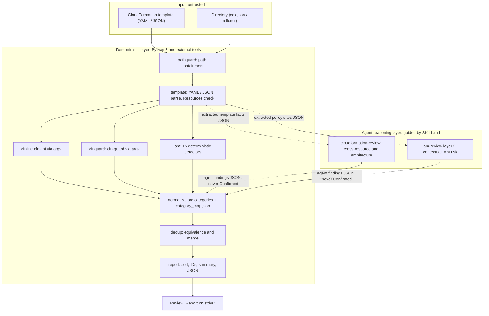

# Architecture

This document records how `aws-iac-review-agent-plugin` is put together and why.
It is the contributor-facing reference for what runs, in what order, which part
of a review is decided by code and which by an agent, and where each guarantee
about the output is enforced.

Three companion documents carry what this one deliberately does not:
`docs/security-model.md` the trust boundaries and residual risks,
`docs/finding-schema.md` the Finding fields and their permitted values, and
`docs/benchmark-methodology.md` how detection quality is measured.

## Review pipeline

A review is a fixed sequence of stages. Exactly one of them admits agent
reasoning, and what that stage produces re-enters the pipeline as data to be
validated rather than as a decision to be trusted.

```text
IaC
 -> deterministic checks (cfn-lint, cfn-guard, IAM detectors)
 -> agent semantic review (IAM context, security, architecture, best practices)
 -> Finding normalization
 -> deduplication and merge
 -> Review_Report
```



Solid edges are deterministic data flow; dotted edges pass through an agent. An
agent can *produce* Findings. It cannot normalize, merge, order, or number them:
everything from normalization onward is deterministic code, which is what keeps
report ordering (Requirement 7 AC15) and byte-identical output (Requirement 16
AC11) out of reach of a model's variability.

### What each layer guarantees

| Layer | Implementation | Guarantee |
| --- | --- | --- |
| Input validation | `iacreview.bootstrap`, `iacreview.pathguard` | Arguments validated before any work; every path resolves inside the workspace root (Requirement 9 AC4, AC5, Requirement 16 AC7) |
| Deterministic detection | cfn-lint, cfn-guard, `iacreview.iam` | `Confidence: "Confirmed"` (Requirement 7 AC8, AC9) |
| Semantic reasoning | The host agent runtime interpreting a `SKILL.md` | `Confidence: "Likely"` or `"Contextual"` (Requirement 7 AC10) |
| Normalization | `iacreview.categories` + `iacreview/category_map.json` | Every Finding carries one category from the closed set (Requirement 14 AC1) |
| Aggregation | `iacreview.dedup`, `iacreview.report` | Deterministic merge, ordering and summary (Requirement 14, Requirement 7 AC15) |

### How agent findings enter the pipeline

Agent review is not deterministic code execution, so the agent is not called as
a function and is not trusted as one either. A reasoning Skill writes a JSON
file that conforms to the Finding schema, and the file is passed to the
orchestrator with `--agent-findings <path>`. `iacreview.agentin` validates it
strictly: a schema violation drops the offending Finding and records the reason
in `errors[]`, a category outside the closed set falls back to `Other`
(Requirement 14 AC3), and `Confidence: "Confirmed"` is demoted to `"Likely"`
with a diagnostic on stderr (Requirement 7 AC10).

A file, rather than stdin: no entry point of this plugin reads prompt input from
stdin (Requirement 16 AC9), and a file is a boundary that can be validated,
re-run, and committed as a test fixture.

### One template, in order

1. Validate argv. Nothing is opened, created, or executed before this succeeds.
2. `pathguard.resolve_within(workspace_root)` on every user-supplied path. A
   path that escapes exits 7.
3. `template.load_template`. A parse failure exits 4 with the error type, line
   and column; a document with no `Resources` mapping exits 8.
4. Run the deterministic Sources in the fixed order `cfn-lint` -> `cfn-guard` ->
   `IAM Review`. The order matches the Evidence concatenation order of
   Requirement 14 AC11, so nothing downstream has to reorder to satisfy it.
5. Fold in agent Findings, when a file was supplied.
6. `dedup.deduplicate`, then `report.sort_findings`, then `report.assign_ids`,
   then `report.build_report` and `report.dump`.

A Source that fails does not end the review. Both an expected failure and an
unexpected exception become one `errors[]` entry and the loop continues with the
remaining Sources (Requirement 4 AC12, Requirement 5 AC6, Requirement 2 AC10).
The cost of a failed Source is its Findings and nothing else, and the report
says which Sources ran in `sources_enabled` and which tools were available in
`tools[]`.

### Several templates, and directories

A directory target is walked recursively for `.yaml`, `.yml`, `.json`,
`.template` and `.template.json`, sorted by path so that the traversal order is
not the filesystem's to choose. `cdk.out`, `node_modules`, `.git` and `.venv`
are not descended into (`iacreview.cdk.EXCLUDED_DIRECTORY_NAMES`).

- **Deduplication runs per template.** The same logical ID in two templates
  names two different resources, so merging across a template boundary would be
  wrong.
- **IDs are report-wide.** All templates' Findings are pooled, ordered once, and
  then numbered from 1 (Requirement 7 AC1).
- **Standalone and synthesized templates are reported separately.**
  `target.files` and `target.cdk.synthesized_templates` hold the two lists, and
  `summary.by_template_group` counts them (Requirement 8 AC10). Each Finding
  names its own template in `Location.File`.

`cdk synth` runs only when `--confirm-cdk-synth` was passed. Without the flag no
`cdk` process is started at all: the gate is structural, inside
`iacreview.cdk.synth_if_confirmed`, and the review continues with whatever is
already under `cdk.out` while an `invalid_arguments` entry records that
synthesis was skipped (Requirement 8 AC3, AC5). The reason the gate is a flag
rather than a prompt is Requirement 16 AC9. Synthesis executes the project's own
code and its dependencies' lifecycle scripts, unsandboxed; that risk is stated
in `docs/security-model.md` and in the README's Known Limitations.

## The deterministic / agent boundary

This is the most consequential decision in the design. Anything an existing tool
can decide is decided by that tool, and anything the requirements enumerate as a
rule is matched by code. Agent reasoning is reserved for judgements that no
closed rule set expresses.

| # | Review concern | Decided by | Why |
| --- | --- | --- | --- |
| 1 | YAML / JSON syntax validity | Deterministic Python (`iacreview.template`) | Parsing is fully deterministic and has to return a line and column (Requirement 3 AC6). An agent asked to parse would report positions imprecisely |
| 2 | CloudFormation-specific syntax: intrinsic function forms, `Ref` targets | cfn-lint (`E1xxx`) | cfn-lint holds the resource specification. Reimplementing its judgement is forbidden by the project's own technical policy |
| 3 | Resource property types, required properties, permitted values | cfn-lint (`E3xxx`) | Same. Tracking AWS specification updates stays upstream |
| 4 | `Parameters` / `Outputs` / `Mappings` / `Conditions` consistency | cfn-lint (`E2xxx`, `E6xxx`, `E7xxx`, `E8xxx`) | Same |
| 5 | Deprecated or redundant constructs (Warning, Informational) | cfn-lint (`W`, `I`) | Same |
| 6 | Explicit organizational policy: encryption, public access, logging, tagging, backup | cfn-guard | Declarative policy is what Guard rules are for, and a rule stays reusable and reviewable as data (Requirement 5 AC8) |
| 7 | Structurally dangerous IAM patterns: `Action: "*"` with `Resource: "*"`, known privilege-escalation actions, `Principal: "*"` | Deterministic Python (`iacreview.iam.detectors`) | Requirement 6 AC1, AC5 and AC9 enumerate the action names, so this is finite-set matching and deserves `Confirmed`. Some of it is expressible in Guard, but per-statement scanning with condition correlation is awkward in the DSL |
| 8 | Cross-account principals: 12-digit account IDs, `AWS::AccountId` recognition, `sts:ExternalId` severity reduction | Deterministic Python (`iacreview.iam.detectors`) | Requirement 6 AC7 to AC10 specify the decision rules completely. Reasoning over a written-down rule adds instability and no accuracy |
| 9 | Category assignment | Deterministic Python (`iacreview/category_map.json`) | Requirement 14 AC4 asks for a single versioned mapping file. Deciding per run would break the closed set (AC1) |
| 10 | Severity, Confidence and FindingType for deterministic Sources | Deterministic Python (normalization in each Source module) | Requirement 4 AC3 to AC9 and Requirement 7 AC8, AC9 specify the mapping |
| 11 | Deduplication and merging | Deterministic Python (`iacreview.dedup`) | Requirement 14 AC5 to AC13 specify the algorithm, which has to be deterministic |
| 12 | Ordering and summary aggregation | Deterministic Python (`iacreview.report`) | Requirement 7 AC15, AC17, and the byte-identical output of Requirement 16 AC11 |
| 13 | Risk in the relationship between resources, for example an execution role holding far more access to a bucket in the same template than the function needs | Agent reasoning | A semantic judgement about a relation. cfn-lint sees one resource at a time and cfn-guard sees declarative conditions; neither can weigh intent across resources. Requirement 2 AC14 assigns this to the agent |
| 14 | Architecture risk: single-AZ topology, single points of failure, scalability concerns | Agent reasoning | Whether a design is sound is context-dependent and does not reduce to a closed rule |
| 15 | AWS best practices that are not encoded as rules | Agent reasoning | Same |
| 16 | Contextual reading of severity, for example a loose setting in a template meant for a development account | Agent reasoning | Context is the agent's contribution. It may not rewrite a severity a deterministic Source assigned; see below |
| 17 | Explaining why an issue matters (`WhyItMatters`) | Agent reasoning for agent Findings; fixed text for deterministic Sources | Deterministic Sources use the mapping file's wording so their output stays stable run to run |
| 18 | Proposing a fix (`SuggestedRemediation`) | Both | A Guard rule carries remediation in its custom message (Requirement 5 AC3); an agent Finding carries generated prose. Neither is ever applied automatically |

### Three things an agent cannot do

1. **It cannot rewrite a deterministic Finding.** Severity, Confidence,
   FindingType and category on a Finding from cfn-lint, cfn-guard or the IAM
   detectors are not addressable by an agent. It can only add its own Finding,
   which reaches the final severity through the merge rules, and since merging
   takes the maximum, an agent cannot lower a severity even indirectly.
2. **It cannot normalize, deduplicate or order.** Those are Python.
3. **It cannot claim `Confidence: "Confirmed"`.** `iacreview.agentin` demotes it
   to `"Likely"` and says so on stderr (Requirement 7 AC10).

### Why deterministic IAM checks are Python rather than reasoning

Requirement 6 enumerates concrete action names, values and decision rules across
eight of its acceptance criteria. Matching an enumeration is deterministic by
definition, so there is nothing for reasoning to add. The development principles
list *contextual* IAM evaluation as agent work, not *structural* IAM matching,
which is why Requirement 6 is implemented as two layers.

## Components

### The shared package `iacreview/`

Requirement 2 AC16 asks for each parsing and normalization routine to exist in
exactly one place, shared by every Skill that needs it. That is in tension with
how Skills are discovered: Agent Plugins 1.0.0 scans the immediate children of
`skills/` and does not recurse, and every package-relative path has to resolve
inside the plugin root. Three placements were considered.

| Option | Shape | Verdict |
| --- | --- | --- |
| A. Duplicate | Copy the shared code into each Skill's `scripts/` | Rejected. Directly violates Requirement 2 AC16 |
| B. One entry point | Put everything in `skills/iac-review/scripts/` and have the other Skills point at it | Rejected. Requirement 2 AC6 to AC9 require each Skill to work on its own, and depending on another Skill's directory breaks that separation |
| C. A package at the plugin root | `iacreview/` beside `skills/`, imported by each Skill's entry point after a path bootstrap | **Adopted** |

Option C holds because:

- `iacreview/` is not under `skills/`, so it can never be mistaken for a Skill.
  Discovery does not look there at all.
- It is inside the plugin root, so containment is satisfied.
- The implementation exists once, satisfying Requirement 2 AC16.
- Each Skill keeps its own entry point, satisfying Requirement 2 AC6 to AC9.

Every Skill entry point starts with the same four lines:

```python
# skills/cfn-lint-review/scripts/run_cfn_lint.py
import sys
from pathlib import Path

# scripts/ -> skill dir -> skills/ -> plugin root
_PLUGIN_ROOT = Path(__file__).resolve().parents[3]
if str(_PLUGIN_ROOT) not in sys.path:
    sys.path.insert(0, str(_PLUGIN_ROOT))

from iacreview import bootstrap  # noqa: E402

bootstrap.require_plugin_root(__file__)
```

`Path(__file__).resolve()` resolves symlinks first, so the root is derived from
where the file actually lives, matching the specification's filesystem-resolved
plugin root. `bootstrap.require_plugin_root` then checks that `plugin.json` is
present and that the derived root is the one the imported `iacreview` package
came from, so a broken installation fails with a clear message instead of a
confusing `ImportError`.

The tradeoffs are accepted knowingly:

| Item | Effect |
| --- | --- |
| The bootstrap is repeated in every entry point | Accepted. It is a fixed prologue, not duplicated logic. Factoring it into a shared module would require a bootstrap to import that module |
| `parents[3]` depends on the directory depth | `iacreview.bootstrap.SCRIPT_DEPTH_TO_PLUGIN_ROOT` states the 3 in one place and `tests/unit/test_bootstrap.py` holds every Skill entry point to it, so a move that changes the depth fails loudly |
| The package is not `pip install`ed | Deliberate. The plugin is distributed as a directory and bundles no binary (Requirement 15 AC1); `pyproject.toml` carries test and lint configuration only |
| Agent Plugins 1.0.0 does not specify where shared code goes | The most conservative position was taken, one that cannot collide with the discovery the specification does define, and it is recorded as an assumption here |

One file deliberately does not use the shared bootstrap.
`benchmark/harness/run_benchmark.py` sits at `benchmark/harness/`, two levels
below the root rather than three, so it states its own `PLUGIN_ROOT_DEPTH = 2`
and performs the same two checks locally. Reusing the Skill helper there would
derive the directory *above* the plugin root and then report a perfectly good
installation as broken. The harness also has two exit codes outside the plugin's
closed table -- `BENCHMARK_FAILURE` (9) and `CASE_NOT_EVALUATED` (10) -- because
a missed benchmark expectation is not one of the plugin's failure classes and
must stay distinguishable from a crash. It is a contributor tool: nothing in
`plugin.json` advertises it and no `SKILL.md` mentions it.

### Every process launch goes through `iacreview.proc`

`proc.run(argv, timeout_s)` is the only place in the plugin that starts a
process. cfn-lint, cfn-guard and `cdk synth` all arrive here, which is what
makes the security properties checkable in one file instead of argued per call
site:

- `shell=False` with an argv array. No shell interprets anything, so shell
  metacharacters carry no meaning and command strings are never built by
  concatenation (Requirement 9 AC4, Requirement 16 AC6). The metacharacter
  rejection in `pathguard` is defense in depth on top of this, not the primary
  control.
- `stdin=subprocess.DEVNULL`. A tool that decides to prompt sees EOF and exits
  instead of hanging (Requirement 16 AC9).
- An environment allowlist: `PATH`, `HOME`, `LANG`, `LC_ALL`, `TMPDIR`,
  `AWS_REGION`, `AWS_DEFAULT_REGION`, and nothing else. Every other `AWS_*`
  variable, including `AWS_ACCESS_KEY_ID`, `AWS_SECRET_ACCESS_KEY`,
  `AWS_SESSION_TOKEN` and `AWS_PROFILE`, is withheld from the child. v0.1 calls
  no AWS API and both review tools are static analyzers, so removing credentials
  structurally prevents an unexpected API call and keeps a credential value out
  of captured stderr (Requirement 9 AC2, AC3). An allowlist rather than a
  denylist, so a variable AWS invents later is withheld by default.
- Errors name the tool by its bare executable name. Callers pass the resolved
  absolute path as `argv[0]` on purpose, so that the binary that was version
  checked is the binary that runs, and stripping the directory here keeps that
  host path out of `errors[]` (Requirement 16 AC11).

`proc.run` does not sandbox the child. Path containment applies to this process,
not to its children; `docs/security-model.md` records that residual risk.

### The IAM review, in two layers

| Layer | Runs | Confidence | Covers |
| --- | --- | --- | --- |
| 1, deterministic | `iacreview.iam` via `run_iam_scan.py` | `Confirmed` | 15 detectors over enumerated action names, wildcard values, principal classes and missing conditions |
| 2, reasoning | The host agent, given `extract_policies.py` output | `Likely` or `Contextual` | Whether a policy that matches no dangerous pattern is still wider than its workload needs |

Layer 1 reports three things a naive scanner would leave silent, and each is a
Finding rather than nothing at all: a value it could not resolve
(`Fn::ImportValue`, `Fn::GetAtt`, a `Ref` to a deploy-time parameter) becomes an
`Informational` / `INFO` disclosure of what the `Confirmed` findings do not
cover; a `PolicyDocument` that is not a mapping is recorded as examined-and-not
-analyzed rather than silently skipped; and a template with no IAM at all
produces zero findings plus an informational message on stderr, which is not the
same answer as a template that was examined and found clean (Requirement 6
AC12). The message is not a Finding, because a Finding names a resource and here
there is none to name.

Layer 1 is conservative on purpose, and one consequence is visible in the
bundled examples. `cross_service_missing_condition` reports a trust policy that
lets a named AWS service call `sts:AssumeRole` with no `Condition` bounding it,
and recommends `aws:SourceAccount`, `aws:SourceArn` or `aws:PrincipalOrgID`.
Those keys only bind if the calling service populates them, and AWS does not
document that for Lambda assuming an execution role: adding the condition there
does not harden the role, it stops the function from being created. The finding
is correct about the shape of the policy and its recommendation is not
actionable for such a service. Layer 1 reports the shape and leaves the
judgement to the reader rather than carrying a per-service table of which
condition keys are honoured, which is why the Finding is `Security` / `HIGH`
rather than a claim that the role is exploitable.
`examples/README.md` works the case through in full, and the README's Known
Limitations records the asymmetry.

### Report assembly

`iacreview.report` owns the last three decisions: what the output looks like,
what order it is in, and what it counts.

**The envelope is exactly seven keys**, `iacreview.report.REPORT_KEYS`:
`schema_version`, `target`, `sources_enabled`, `tools`, `findings`, `errors`,
`summary`. Every Skill emits the same seven, so a consumer that does not know
which Sources ran can still read the report. There is **no `stats` key** in the
envelope, and none is added by the aggregating Skill: the key set of a
multi-Source counters object would depend on which Sources ran, which is exactly
what stdout must not do.

One Skill adds a counter beside the envelope. `run_cfn_guard.py` emits a
top-level `stats` object next to the seven keys, because Requirement 5 AC4
obliges a clean cfn-guard run to state how many rules it evaluated, which makes
the count part of the *result* rather than a diagnostic (design.md
[Correction] C-10). Every other counter this plugin produces is a diagnostic and
goes to stderr under `--verbose`. `tests/unit/test_skills.py` holds each
`SKILL.md` to that contract, and the per-Skill integration tests hold the actual
bytes to it.

**Merging.** Two Findings are equivalent when they share `(Resource,
Normalized_Category)`. A Finding whose category is `Other`, or whose `Resource`
is `null`, has no equivalence key and always survives on its own: `Other` means
"did not map to the closed set", so two `Other` findings on one resource are
probably unrelated problems that would become one incoherent Finding if merged.
On merge, `Severity` and `FindingType` take the strongest value, `Evidence` is
concatenated in Source order, `Source` becomes the sorted union, and the
representative wording comes from the earliest Source in that order, which keeps
a model's prose out of the representative text.

Two corrections shape the merged result:

- **[Correction] C-8: `Confidence` is capped at `Likely` when the Source union
  contains `Agent Review`.** Taking the maximum Confidence and the union of
  Sources independently would produce a `Confirmed` Finding that lists
  `Agent Review`, which Requirement 7 AC10 forbids and `finding.validate`
  rejects. The merge takes the maximum and then rounds down. Nothing is lost:
  the deterministic Sources are still named in `Source` and their evidence is
  still in `Evidence`. A claim resting partly on the weakest ground should not
  call itself `Confirmed`.
- **[Correction] C-9: sequence indices in `Location.TemplatePath` are `int`,
  mapping keys are `str`.** cfn-guard reports a property path as a
  separator-joined string, so without canonicalization it would spell the same
  position `"0"` where cfn-lint and the IAM detectors spell it `0`, and two
  Locations pointing at one statement would look like two positions.
  `iacreview.finding.canonical_template_path` is the single definition, applied
  once to the assembled path. Index 1 is exempt: a top-level section is always a
  mapping, so its member is a key, and an all-digit logical ID is valid
  CloudFormation that would otherwise be converted into a position that does not
  exist.

**Ordering and IDs.** Findings are sorted by the total key of Requirement 7
AC15, and only then numbered from 1, so the same set of Findings always yields
the same IDs. Serialization is `json.dumps(..., sort_keys=True,
ensure_ascii=False, indent=2)` with a trailing newline, on a stdout pinned to
UTF-8 and `\n`. Nothing environment-dependent reaches the report: no timestamp,
no absolute path, no user or host name, no tool location. Values that are
operationally useful but environment-dependent -- generation time, resolved tool
paths, the absolute workspace root, elapsed time -- go to stderr under
`--verbose`, and `--verbose` never changes stdout.

The determinism guarantee has a stated limit. Agent Finding *generation* is not
deterministic. What is guaranteed is that the pipeline is byte-identical for the
same input excluding agent Findings, and byte-identical again for the same agent
Findings JSON -- which is what makes a recorded agent output usable as a
regression fixture.

## cfn-lint

### Invocation

```text
cfn-lint -f json -c I -- <template>
```

One template per run, 60 second timeout, argv array, no shell. `-c I` is not
optional decoration: cfn-lint does not evaluate Informational rules by default,
so without it the `Informational` level of Requirement 4 AC7 and the separate
`Informational` count of Requirement 7 AC17 would be unreachable, and the
mapping for them would be dead code that looks satisfied (design.md
[Correction] C-7).

### The exit status is a bit mask, not an ordinal

cfn-lint sets bit 1 (value 2) when it reported an Error, bit 2 (value 4) for a
Warning and bit 3 (value 8) for an Informational result, and combines them. So
6 means "Errors and Warnings were reported", not "something worse than 4
happened".

`decode_cfnlint_exit` therefore tests which bits are set rather than comparing
magnitudes: a status whose set bits all fall inside `{2, 4, 8}` is a *successful*
run that found something (Requirement 4 AC11), and a status with any bit outside
that set, exit 1 included, is a crash or a usage error (Requirement 4 AC12).
`CFNLINT_FINDING_BITS` is that mask, 14. Reading the status as a magnitude would
report a warning-only template as a tool failure and would misclassify a real
crash as findings. design.md records this as [Correction] C-1 against the
original wording of AC11 and AC12.

`stats` for this Source reports `results_parsed`, `rules_triggered` and
`informational_rules_enabled` as diagnostics on stderr. It deliberately has no
`rules_evaluated`: cfn-lint's JSON lists the rules that *fired*, never the
number it evaluated, and inferring a total from distinct rule IDs would report a
number cfn-lint never claimed.

## cfn-guard

### Observed exit codes (cfn-guard 3.2.1)

cfn-guard documents that exit 0 means every rule passed. It does not enumerate
its non-zero codes, and the values are not stable across versions. The table
below is what this project measured, not a contract cfn-guard offers.

| Item | Value |
| --- | --- |
| cfn-guard version observed | **3.2.1** (`cfn-guard --version`) |
| Platform | macOS (arm64) |
| Rule set | the 35 bundled `.guard` files under `rules/` |
| Command | `cfn-guard validate --data <template> --rules <dir> --output-format json --type CFNTemplate --show-summary none` |

| # | Case | Exit code | stdout | stderr |
| --- | --- | --- | --- | --- |
| a | Every applicable rule passes | `0` | 35 JSON records, one per rule file, `status` `PASS` or `SKIP`, all `not_compliant` empty | empty |
| b | Rule violations | `19` | 11 JSON records, 9 with `status: "FAIL"` and populated `not_compliant` | empty |
| c | Unparsable template (`--data` is not valid YAML/JSON) | `255` | **empty** | `Error occurred Parser Error when parsing ...`, quoting the head of the data file |
| d | `--rules` points at a path that does not exist | `255` | **empty** | ``Error occurred The path `<path>` does not exist`` |
| e | A `.guard` file that fails to parse | `5` | **empty** | `Parsing error handling rule file = <file>, Error = Parser Error ...`, with the line and column |

Three observations matter more than the individual numbers.

**The violation code carries no count.** Case b returned `19` for 9 violated
rules; the same code came back for a template violating a single rule, and for a
run restricted to `rules/encryption` that violated 2. So `19` is a fixed
"violations were found" code, and reading a count out of it would be wrong.

**Failures are not ordered by severity.** `255` (case c and d) and `5` (case e)
sit on either side of `19`, so no comparison against a threshold separates
"violations" from "the tool failed". A magnitude-based reading, of the sort that
works for cfn-lint's bitmask, has no analogue here.

**Every failure case produced empty stdout.** Cases c, d and e wrote nothing to
stdout and put the explanation on stderr. This is the property the plugin's
classification actually rests on, and it is why an empty payload is rejected
rather than read as "no violations": for cfn-lint, silent stdout is a clean run;
for cfn-guard it is the signature of a failed run.

### Why the plugin does not branch on these values

`iacreview.cfnguard.interpret_guard_result` classifies a run structurally:

1. `timed_out` -> `timeout`. A killed process's status describes the kill.
2. Exit `0` -> `all_passed`. The one status cfn-guard documents.
3. Any other status -> parse stdout. Parses as the expected record structure ->
   `violations`; does not -> `tool_error`.

Requirement 5 AC7 requires this: the violation / failure decision is made by
whether stdout parses as the expected result structure, and **not** by the
specific exit code value. The observed code is recorded on the interpretation
and reaches `StructuredError.exit_code` (Requirement 15 AC7), but no branch
reads it.

Measuring the codes permits adding an exit-code fast path (design.md, O-1), and
this project deliberately does not add one:

- It would save no work. `19` still needs stdout parsed to obtain the payload,
  and `5` / `255` are already resolved by the parse of an empty payload failing.
  There is no case where knowing the code lets the plugin skip a step.
- It would add a second source of truth. A cfn-guard release that renumbers its
  codes, or a build that returns `19` with unusable stdout, would then be
  classified two different ways depending on which branch ran first.
- Version robustness is the point of the requirement, and hardcoding `19` is
  what it forbids.

The values above are therefore documentation and regression anchors, not control
flow. `tests/unit/test_cfnguard_parse.py` pins them as the `(exit code, stdout
shape) -> classification` table, asserting that all three non-zero codes
classify identically for identical stdout.

### `rules_evaluated` and `rules_passed`

Requirement 5 AC4 requires a clean run to report the count of rules evaluated.
cfn-guard has no such counter, so the plugin derives it, by one of two paths.
`stats.rules_evaluated_source` names which one ran, because the two do not mean
quite the same thing.

**From cfn-guard's output** (`rules_evaluated_source: "cfn-guard output"`). Each
record names the rules it has something to say about: `compliant` (passed),
`not_applicable` (the rule's `when` guard did not match), and one `not_compliant`
entry per violated rule. Taking the union over all records:

```text
rules_evaluated      = count of distinct names in (compliant + not_applicable + violated)
rules_passed         = count of distinct names in compliant
rules_not_applicable = count of distinct names in not_applicable
```

Case a above yields `rules_evaluated = 35`, matching the 35 bundled `.guard`
files, which is the check that this reading is the correct one.

**From rule declarations** (`rules_evaluated_source: "rule declarations"`), used
when no record carries a `compliant` or `not_applicable` list, as a future output
format might not:

```text
rules_evaluated      = number of `rule` declarations found under the scanned rule directories
rules_passed         = max(rules_evaluated - count of distinct violated names, 0)
rules_not_applicable = null
```

The `max()` guards against a rule name appearing in the output that no scanned
directory declares, which would otherwise drive `rules_passed` negative.

The difference between the two paths is in how a skipped rule is counted:

| | Counted from output | Counted from declarations |
| --- | --- | --- |
| A rule whose `when` guard did not match | `rules_not_applicable` | invisible, so it lands in `rules_passed` |
| `rules_not_applicable` | a number | `null`, rather than a claim of zero |
| Rules present in output but not on disk | counted in `rules_evaluated` | not counted |

So `rules_passed` from the fallback path is an upper bound: it cannot distinguish
"passed" from "never ran". `rules_not_applicable` is `null` rather than `0` so
that this is visible in the report instead of being asserted as a measurement.
Counting `rule` declarations is exact for the bundled rule set because
`tests/unit/test_guard_rules.py` asserts one `rule` declaration per `.guard`
file, with a name matching the filename.
## Degraded operation and scope boundaries

Four questions come up often enough that the answers belong in the architecture
rather than in a commit message. Each is about what the plugin does *not*
guarantee, and why that is the right boundary.

### Reviewing JSON templates without PyYAML

PyYAML is the plugin's only runtime Python dependency (Requirement 16 AC3
permits the standard library plus at most one YAML parser). The plugin is
distributed as a directory rather than an installed package, so PyYAML may
legitimately be absent, and a JSON template needs no YAML parser at all.

`iacreview.yamlcfn` therefore imports PyYAML *inside* its functions rather than
at module scope, and the failure is deferred to the moment YAML is actually
parsed. In an environment without PyYAML, reviewing a JSON template works
completely; reviewing a YAML template fails with a `tool_unavailable` error
naming `PyYAML`, its minimum version 6.0, and `pip install 'PyYAML>=6.0'` as the
remediation.

Which parser is used is decided by content, not by file extension: a document
whose first non-whitespace character is `{` or `[` is parsed as JSON, everything
else as YAML. A JSON template named `.yaml` is common enough that trusting the
extension would send it to a YAML parser, where it would usually work by
accident, since JSON is very nearly a YAML subset, and then fail obscurely on the
cases where it does not.

The YAML loader is a `SafeLoader` subclass with an explicit allowlist of the
CloudFormation short tags (`!Ref`, `!GetAtt`, and the rest), converted to their
long forms at parse time. An unknown tag raises rather than being constructed.
`docs/security-model.md` explains why the allowlist is per tag rather than a
multi-constructor.

### External tool version differences are outside Requirement 10 AC3

Requirement 10 AC3 requires the deterministic components to produce identical
results for the same template regardless of host operating system, among macOS
and Linux. It is a statement about the operating system, not about the versions
of the tools installed on it.

cfn-lint and cfn-guard each evolve their own rule sets. A newer cfn-lint may
report a rule an older one did not, and a newer cfn-guard may format its JSON
differently. Findings that differ for that reason are not an OS inconsistency and
are outside AC3. What the plugin does instead is record the version it observed
in `tools[].version`, so a report says which tool produced it, and the property
test for determinism pins a tool's output rather than a tool's version.

The version differences the plugin *does* absorb are structural: the cfn-guard
classification above reads whether stdout parses as the expected structure rather
than which exit code came back, precisely so that a release renumbering its codes
does not change the verdict.

The README's Known Limitations lists tool version variation as a known source of
differing results, and the minimum supported versions are cfn-lint 1.0.0,
cfn-guard 3.0.0, AWS CDK CLI 2.0.0 (needed only for `--confirm-cdk-synth`),
Python 3.9 and PyYAML 6.0.

### Development and test dependencies are outside Requirement 16 AC3

Requirement 16 AC3 constrains the *runtime* dependencies of the deterministic
script components enumerated in AC1 -- template parsing, tool output parsing, IAM
analysis, normalization, deduplication and benchmark aggregation -- to the
standard library plus one YAML parser. Requirement 16 AC4 then states explicitly
that development and test dependencies are declared separately and are not
subject to that constraint. Test code is not one of the components AC1 lists.

So the runtime dependency count stays at exactly one, PyYAML, while `pytest`,
`pytest-cov` and `hypothesis` are dev dependencies declared in `pyproject.toml`.
`hypothesis` is the one that could not be replaced by hand: implementing
shrinking and reproducible seeds is not a reasonable thing to write for this
project. None of the three is imported by any module under `iacreview/`, by any
Skill entry point, or by the benchmark harness, so an installation that runs
reviews needs none of them. CONTRIBUTING.md carries the same interpretation and
the procedure for proposing a new dependency.

### `extensions` is unused in v0.1

`plugin.json` contains no `extensions` field and the repository contains no
reverse-domain extension directory.

Requirement 10 AC2 asks for vendor-specific settings to be separated from the
portable core, using `extensions` or a designated extension directory. v0.1
satisfies it by having no vendor-specific settings at all: there is nothing to
separate, so no separation mechanism is needed. Everything Requirement 10 AC1
calls core review functionality -- running cfn-lint, running cfn-guard, IAM
review, unified report generation -- is Skills, Python and external tools.
Hooks, commands and agent definitions are not portable v1 components, so
depending on one would create an experience that other clients silently drop,
which is what Requirement 10 AC9 is there to prevent. An empty `extensions`
would be schema-legal and mean nothing.

The portable core and the client-specific parts split like this:

| Component | Classification |
| --- | --- |
| `plugin.json` | Portable. Conforms to the Agent Plugins 1.0.0 closed schema |
| `skills/**/SKILL.md` | Portable. Agent Skills format, which Agent Plugins does not redefine |
| `skills/**/scripts/*.py`, `iacreview/**` | Portable. Python 3 only |
| `rules/**` | Portable. cfn-guard rule DSL |
| `docs/kiro-power.md` | A portable file whose content is Kiro-specific. Documentation, not part of loading |
| `.kiro/steering/`, `.kiro/specs/` | Kiro-specific development files, not needed to run the plugin |

Requirement 10 AC8 is satisfied structurally: `skills/` holds exactly five child
directories, each with a `SKILL.md`, which is the one shape a non-recursive
discovery scan is guaranteed to find. Kiro-specific installation steps live in
`docs/kiro-power.md`, separate from the portable packaging.

If a Kiro-specific hook is ever needed, the way to add it is a `dev.kiro`
namespace under `extensions` in `plugin.json`, with a matching top-level
directory if one is required, leaving the portable core loadable without either.
That is a future change, not a current capability.
