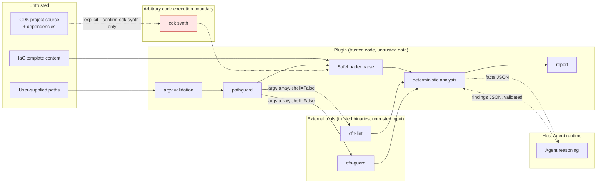

# Security Model

This document records what `aws-iac-review-agent-plugin` defends against, what
it does not, and why each choice was made.

The plugin exists to review Infrastructure as Code that it has no reason to
trust. Every input Template, every path, and every byte of external tool output
is untrusted data. The plugin's own code is trusted; nothing it reads is.

Two things follow from that, and they organize this whole document. First, the
plugin is read-only and calls no AWS API, so the blast radius of a review is the
machine it runs on rather than an AWS account. Second, the controls that matter
are concentrated in a small number of modules, so each claim below names the
module that implements it and the test that pins it.

The last section lists residual risks. They are stated rather than downplayed:
a security document that only lists defenses is a document a reader cannot
calibrate against.

## Default Posture: Read-Only

| The plugin does not | Enforced by |
| --- | --- |
| Create, modify, or delete an AWS resource | No AWS API is called at all. There is no AWS SDK dependency: `pyproject.toml` declares PyYAML as the single runtime dependency (Requirement 9 AC3, Requirement 16 AC3) |
| Deploy anything | No deploy path exists. cfn-lint and cfn-guard are static analyzers, and `cdk synth` produces a Template without contacting AWS |
| Change an AWS account setting | Same as above: no API client exists to change one with |
| Apply a fix | A remediation is reported as the `SuggestedRemediation` field of a Finding. Nothing writes it anywhere |
| Write to your workspace | No module under `iacreview/` or `skills/` opens a workspace file for writing, creates a directory, or copies a file. The only file-creating code in the package is `secure_temp_file`, which writes to the system temporary directory and which no v0.1 code path calls |

Two qualifications keep that table honest.

`cdk synth` is the exception, and it is not a small one. When you pass
`--confirm-cdk-synth`, the CDK CLI runs your project's code, and that code may
write whatever it likes, starting with `cdk.out/`. It has its own section below.

Agent Review involves a file the plugin reads but does not write. The host agent
writes its Findings as JSON and `run_iac_review.py --agent-findings <path>` reads
them back. Writing that file is the agent's action, under the host runtime's own
permissions; `iacreview.agentin` only validates what arrives.

## Trust Boundaries



Eight boundaries are crossed during a review. Each one has exactly one control,
and each control lives in one module.

| # | Boundary | What crosses | Control | Implemented in |
| --- | --- | --- | --- | --- |
| B-1 | Untrusted path to Plugin | A path string | Metacharacter rejection, then containment against the workspace root (Requirement 9 AC4, AC5) | `iacreview.pathguard` |
| B-2 | Untrusted Template to Plugin | YAML or JSON text | A `SafeLoader`-derived parser with an explicit tag allowlist. Nothing is evaluated (Requirement 9 AC7) | `iacreview.yamlcfn`, `iacreview.template` |
| B-3 | Plugin to external tool | An argv array | `shell=False`, argv arrays, no string concatenation, closed stdin, an environment allowlist, a timeout (Requirement 9 AC4, Requirement 16 AC6, AC9) | `iacreview.proc` |
| B-4 | External tool to Plugin | stdout, and up to 5 lines of stderr | Structural validation of stdout; output that does not match the expected shape is discarded rather than guessed at | `iacreview.cfnlint`, `iacreview.cfnguard` |
| B-5 | CDK source to `cdk synth` | Arbitrary code execution | An explicit confirmation flag, a stated warning, a 120 second timeout, no fallback, and no sandbox (Requirement 8 AC3-AC7, AC11) | `iacreview.cdk` |
| B-6 | Plugin to Agent | Facts JSON | Deterministic extraction only, with bounded excerpt sizes and a depth-limited walk. A `NoEcho` Parameter's `Default` is replaced by the redaction placeholder before it can reach stdout, and paths are rendered workspace-relative | `skills/cloudformation-review/scripts/extract_facts.py` |
| B-7 | Agent to Plugin | Findings JSON | Full schema validation, `Source` checked rather than overwritten, `Confirmed` demoted to `Likely` (Requirement 7 AC10) | `iacreview.agentin` |
| B-8 | Plugin to AWS | **Nothing** | v0.1 calls no AWS API (Requirement 9 AC3) | not applicable |

## External Command Execution

`iacreview.proc.run` is the only place this plugin starts a process. cfn-lint,
cfn-guard, and `cdk synth` all go through it. Concentrating process creation in
one function is what makes the properties below checkable by reading one file
instead of auditing every call site.

| Control | What it does |
| --- | --- |
| `shell=False`, argv as a list | No shell exists to interpret an argument, so shell injection cannot occur. `argv` arrives as a list and is handed to `subprocess.run` as a list; no code path in the module joins tokens into a string (Requirement 16 AC6) |
| `stdin=subprocess.DEVNULL` | A child runs non-interactively. A tool that decides to prompt reads EOF and exits instead of hanging until the timeout (Requirement 16 AC9) |
| An environment allowlist | Only the variables listed below reach a child |
| `shutil.which` resolution up front | A missing tool is reported as `tool_unavailable` with an install instruction rather than surfacing as an OS error (Requirement 15 AC4) |
| A timeout on every invocation | The child is killed and reaped before the timeout is reported |
| Errors name the bare executable | `argv[0]` may be an absolute path, so that the binary whose version was checked is the binary that runs. `_tool_name` reduces it to its final component before it reaches a message, because the report may not carry an absolute host path (Requirement 16 AC11) |
| No user value can be read as a flag | The cfn-lint command line ends with `-- <template>`, so a filename beginning with `-` cannot be taken for an option; the cfn-guard command line passes the Template as the value of `--data`, where the same is true positionally. Every other argv element is a fixed flag the plugin owns |

The environment allowlist is `INHERITED_ENV_VARS`, and it is exactly:

```text
PATH  HOME  LANG  LC_ALL  TMPDIR  AWS_REGION  AWS_DEFAULT_REGION
```

Everything else is dropped, which means `AWS_ACCESS_KEY_ID`,
`AWS_SECRET_ACCESS_KEY`, `AWS_SESSION_TOKEN`, and `AWS_PROFILE` are withheld
from every child process even when they are set in the parent environment. This
is an allowlist and not a denylist on purpose: a denylist would silently leak any
credential variable that AWS introduces later, or that a wrapper tool invents.
`AWS_REGION` and `AWS_DEFAULT_REGION` are inherited because some cfn-lint
features need a region to resolve region-specific data. Neither is a credential.

Withholding credentials is structural rather than cosmetic. v0.1 calls no AWS
API and both external tools are static analyzers, so a child has no legitimate
use for a credential; removing them prevents an unexpected API call and prevents
a credential value from appearing in captured stderr (Requirement 9 AC2, AC3).

`tests/property/test_prop_pathguard.py` establishes that `iacreview.proc` really
is the single funnel, rather than leaving it as a convention. It parses every
shipped `.py` file under `iacreview/`, `skills/`, and `benchmark/` with `ast` and
reports three things as violations: an import of `subprocess` or `pty` anywhere
other than `iacreview/proc.py`, a call to any of eighteen process-starting `os`
functions (`os.system`, `os.popen`, the `exec*` and `spawn*` families,
`posix_spawn`, `forkpty`) anywhere at all, and a `shell=` keyword whose value is
not the literal `False`. It then asserts that the shipped directories contain no
shell script, because a shell wrapper is the one place a command could be built
by concatenation with no Python syntax tree to reveal it, and "for any
invocation" is not a claim a Python-only scan can close.

That is a stronger guarantee than a call-site review: it fails if a future
contributor adds a second process-spawning path anywhere in the package.

### Shell Metacharacter Rejection Is Defense in Depth

Requirement 9 AC4 asks for execution to be refused when an input value contains
one of `;`, `|`, `&`, `$`, a backtick, `>`, or `<`.
`iacreview.pathguard.assert_no_shell_metacharacters` does that, and it is
important to be clear about where it sits.

**The primary control is `shell=False` plus argv arrays.** Under that control no
shell exists, those characters carry no special meaning, and a file genuinely
named `report.yaml; rm -rf /` would be analyzed rather than executed. The
character check adds three narrower things:

1. Insurance against a future change that adds a shell-based execution path by
   mistake.
2. Early rejection of a hostile filename, so it never reaches a log, a Finding,
   or a report message.
3. A concrete assertion target for the regression case Requirement 12 AC11 asks
   for by name.

**Values are rejected, never sanitized.** Stripping a `;` out of a path string
would silently redirect the read to a *different file*, which is a worse outcome
than an explicit error and one nobody would notice.
`tests/regression/test_sec_shell_metacharacters.py` asserts the error rather
than a repaired path, precisely so that a later "helpful" rewrite cannot pass.

**The set is exactly seven characters.** A quote, a space, or an apostrophe is
ordinary in a filename and is not a shell escape under `shell=False`, so none of
them is rejected. The same regression file pins an accepted filename containing
quotes and spaces, so the check cannot drift into "reject anything unusual" and
make normal workspaces unreviewable in the name of security.

**Side effect: a legitimate filename containing `$` is rejected.** A file named
`cost$estimate.yaml` cannot be reviewed by this plugin in v0.1. This is accepted
rather than worked around, because the alternative -- deciding per character
whether an occurrence is "really" dangerous -- reintroduces the sanitization
problem above. The rejection is an explicit, named error, so the cause is
visible to the user rather than appearing as a mysterious absence, and it belongs
in the README's Known Limitations for the same reason it is recorded here.

**Plugin-owned paths are exempt from the metacharacter check.** The plugin's own
resources -- `rules/`, `category_map.json` -- are resolved by
`resolve_plugin_owned`, which applies containment against the plugin root and
nothing else. Two reasons: the value does not originate from user input, and the
plugin may legitimately be installed under a directory whose name contains one
of the seven characters. Applying the user-input check there would make a
correctly installed plugin refuse to load its own rule set (Requirement 15 AC3).
User input is checked and contained; plugin-owned paths are only contained.

## Path Safety

Every path that reaches an argv array or an `open()` call passes through
`iacreview.pathguard` first. Containment is decided in one place, with one rule.

```text
resolve_within(candidate, workspace_root)   user input:        check + contain
resolve_plugin_owned(relative)              plugin resources:  contain only
```

Both normalize with `Path.resolve()` and then compare against the root with
`Path.relative_to`. The order and the choice of comparison are both load-bearing:

| Decision | Why |
| --- | --- |
| Normalize first, compare second | A string search for `..` misses an escape through a symlink that contains no `..` at all, and it also rejects `a/b/../c`, which never leaves the root |
| `relative_to`, not `str.startswith` | A prefix test on strings accepts `/workspace-evil` for root `/workspace`. `relative_to` compares path components, so that mistake cannot happen |
| Containment before existence | A dangling symlink pointing outside the root is refused as a containment violation, not as a missing file. Deciding existence first would leak the distinction |
| Symlinks are followed | `Path.resolve()` returns the real path, so a link inside the workspace that points outside it resolves outside the root and is refused. A link *outside* the root that points back *in* resolves inside and is accepted, which is correct: the file being read is inside |
| An empty or blank path is refused | It would otherwise resolve to the root itself, silently turning "no path given" into "review the entire workspace" |
| Two roots, never one | User input is contained to the workspace root; plugin-owned resources to the plugin root. That root is derived from the location of `iacreview/pathguard.py` and then confirmed by the presence of `plugin.json`, so a moved or partially installed package fails loudly instead of silently containing paths to the wrong directory |

Failures are typed, which is what lets an entry point exit with a documented
code instead of a traceback: `UnsafeArgumentError` and `InvalidArgumentsError`
report `invalid_arguments` and exit 2, `PathContainmentError` reports
`path_violation` and exits 7, `InputNotFoundError` reports `input_not_found` and
exits 3.

Evidence: `tests/property/test_prop_pathguard.py` (Property 18) quantifies over
candidate strings and over roots, and builds ten symlink shapes on disk --
including a link out, a relative link out, a directory link, two-hop chains in
both directions, a link outside pointing in, two dangling links, and a cycle --
checking every one against an independently computed oracle.
`tests/regression/test_sec_path_traversal.py` pins the named examples, including
both of the cheap implementations that look correct and are not.

### Temporary Files

`secure_temp_file` is the only way this plugin creates a temporary file
(Requirement 9 AC6).

- `tempfile.mkstemp` creates the file in the system-designated temporary
  directory, honouring `TMPDIR`, with an unpredictable name, `O_EXCL`, and mode
  `0600`. The unpredictable name plus `O_EXCL` is what defeats a symlink attack
  on a world-writable `/tmp`; the explicit `os.chmod(path, 0o600)` that follows
  re-confirms the mode rather than being the control itself.
- A `finally` block removes the file on both the normal and the exception path.
- A module-level registry, an `atexit` hook, and `SIGTERM` / `SIGINT` handlers
  cover the cases `finally` cannot reach. The handlers chain to whatever handler
  they displaced, so importing this module does not change a host runtime's
  shutdown behaviour as a side effect.
- The registry is mutated only with `set.add` and `set.discard` and read only
  through `list()`, with no lock. A lock would be the usual choice, but a signal
  handler runs on the main thread and would deadlock if it interrupted that
  thread while it held the lock.
- **`SIGKILL` cannot be caught**, so a hard kill leaves the file behind for the
  OS temp sweeper. See R-6.
- A suffix containing a path separator is refused, because `mkstemp` appends the
  suffix to a generated name and a separator would place the file somewhere the
  reasoning above does not cover.

No v0.1 code path calls this helper. cfn-lint and cfn-guard both accept the
Template path directly and return results on stdout, so no intermediate file is
needed. The helper exists so that the first caller who needs one does not invent
a weaker version. `tests/unit/test_tempfile.py` covers the mode, the directory,
removal after the block, removal when the block raises, removal on `SIGTERM` in
a real child process, interpreter exit inside an open block, handler chaining,
and the rejected suffixes. `tests/property/test_prop_security.py` (Property 22)
states the same claim as an absence paired with a positive control.

## Untrusted IaC

A malformed or hostile Template must fail without arbitrary code execution, a
leaked secret, disclosed environment information, or a read of an unrelated file.

**YAML.** `iacreview.yamlcfn` derives its loader from `yaml.SafeLoader` and
registers each permitted CloudFormation short-form tag with its own
`add_constructor` call. `yaml.Loader`, `yaml.UnsafeLoader`, and the default
loader of `yaml.load()` are never used, so tags such as
`!!python/object/apply:os.system` raise instead of executing. The registration
is deliberately **not** `add_multi_constructor` on the `!` prefix: a
multi-constructor accepts *any* local tag, including ones a future PyYAML or a
hostile Template invents. With an explicit allowlist, an unknown tag reaches
`SafeConstructor`'s undefined handler and becomes a parse error. Registering on
the subclass also leaves `yaml.SafeLoader` itself untouched, so an unrelated
`safe_load` elsewhere in the process gains no new capability.

**JSON.** `json.loads`, with no `object_hook` and no `parse_constant`.

**Intrinsic functions are data.** `!Ref X` becomes `{"Ref": "X"}` and
`!GetAtt A.Arn` becomes `{"Fn::GetAtt": ["A", "Arn"]}`. That is a rewrite of
representation only. No value is resolved, evaluated, or executed, and no value
taken from a Template can reach an argv array: an argv array is built from fixed
flags the plugin owns plus a contained user-supplied path.

**Every failure is typed and carries a position.**
`iacreview.template.parse_template_text` catches broadly and re-raises
`TemplateParseError` with `error_type`, `line`, and `column` (Requirement 3 AC6,
Requirement 12 AC8). The broad catch is deliberate: a few kilobytes of `[`
exhausts the interpreter stack and `json` raises `RecursionError`, which is not a
`ValueError` and would otherwise escape as a traceback with an undefined exit
status. `IacReviewError` is never swallowed by that handler, so a missing PyYAML
still reports as `tool_unavailable` rather than being relabelled a parse failure.

Evidence: `tests/integration/test_malformed_input.py` runs fourteen bad inputs
across the six entry points as subprocesses -- 133 cases -- asserting the exit
code, both streams, and the absence of a traceback. Running them as subprocesses
is the point: the exit code and the absence of a traceback are properties of a
process, not of a function.
`tests/regression/test_sec_malformed_yaml.py` and
`tests/regression/test_sec_malformed_json.py` pin the named cases, including the
`!!python/object` tag and the exact line and column of a TAB in indentation.
`tests/property/test_prop_template.py` states Property 17 (safe failure for any
byte string) and Property 21 (Template content is never executed, with the
constructor side effect actually observed rather than assumed absent).

## Credentials

| Rule | How it holds |
| --- | --- |
| No credential in any repository file | Benchmark and Example values are obvious placeholders. `tests/unit/test_ground_truth.py` scans every benchmark Template for seven credential patterns, including an AWS access key ID shape and a PEM private key header, and asserts that the only 12-or-more-digit number present is the documentation placeholder account ID `123456789012` |
| No credential in output | Deterministic Sources set `Excerpt` to `None`; their `RuleId` is their evidence. Agent Review is the only Source that quotes Template text, and every accepted agent Finding passes through `redact_finding` on the way out |
| No credential to a child process | The `INHERITED_ENV_VARS` allowlist in `iacreview.proc` withholds `AWS_ACCESS_KEY_ID`, `AWS_SECRET_ACCESS_KEY`, `AWS_SESSION_TOKEN`, `AWS_PROFILE`, and every other `AWS_*` variable except the two region variables |
| Bounded transcription of tool stderr | `stderr_head` is capped at the first 5 lines (Requirement 15 AC7), which also bounds how much untrusted tool output can reach the report. See R-4 |

Requirement 9 AC1 covers every repository file, naming manifests, source code,
examples, benchmarks, and documentation; the project's security policy adds logs
and tests to the same list. The rule is the same in all of them: a placeholder,
never a value that could be real. A benchmark Template is allowed to be insecure
by design -- that is what makes it a benchmark -- and is still not allowed to
demonstrate a hardcoded secret, because contributors read those Templates looking
for a pattern to copy.

### Excerpt Redaction

A Finding's Evidence is what makes it actionable, but a Template with a
hardcoded secret in it turns a quoted Excerpt into a copy of that secret,
travelling wherever the report travels: a log, a CI artifact, an issue. Where
those two goals conflict, non-propagation of the secret wins over completeness of
the Evidence (Requirement 9 AC2).

Redaction replaces the quotation with a fixed string rather than dropping the
field, because Requirement 7 AC11 requires a non-`Confirmed` Finding to carry an
Excerpt, and a dropped field would turn a credential into a schema violation. The
affected Evidence entry also gets a sentence appended to its `Detail` saying that
redaction happened and why, so that a reader can distinguish "nothing was quoted
here" from "something was quoted and withheld".

**There are exactly two triggers.**

1. The location references a Parameter declared `NoEcho: true`, or is part of
   that Parameter's own declaration.
2. A cfn-lint rule in `CREDENTIAL_RULE_IDS` -- which is exactly `W1011` and
   `W2501` -- reported the location.

**Key-name pattern matching was considered and rejected for v0.1.** Redacting
because a key is named `password`, `secret`, `token`, or `apikey` was the obvious
third trigger, and it is not implemented. Both implemented triggers are decidable
from the Template's own declarations; a key-name pattern is a guess, and it fails
in both directions. It would redact `PasswordPolicy` and every IAM Finding that
quotes it, blunting exactly the Evidence that makes those Findings actionable,
and it would still miss a credential stored under an unrelated key name. Adding a
control that degrades good Findings while providing no guarantee against the case
it targets is a worse trade than declining it and saying so. See R-7 for what
this leaves uncovered.

`W2010` -- a `NoEcho` Parameter referenced from `Metadata` or `Outputs` -- is
also deliberately absent from `CREDENTIAL_RULE_IDS`, because the locations it
reports are already covered by trigger 1, and a second path to the same decision
is a second thing to keep in agreement.

Evidence: `tests/unit/test_finding.py` covers each trigger and each deliberate
non-trigger, including a key merely *named* `password`.
`tests/property/test_prop_security.py` (Property 29) asserts that a credential
value placed in a Template reaches no Excerpt in the report.

## `cdk synth`: The Arbitrary Code Execution Boundary

Reviewing a CDK project from source is qualitatively more dangerous than
everything else this plugin does, because producing a Template from CDK source
means running that source. The warning is stated once in `iacreview/cdk.py` as
`SYNTH_WARNING`, and everything that mentions the risk quotes that constant:

> cdk synth executes this project's own code and the lifecycle scripts of its
> dependencies. This plugin provides no sandboxing for that execution: the synth
> process runs with your full user privileges. Review CDK source you do not
> trust only after inspecting it.

| Control | Detail | Requirement |
| --- | --- | --- |
| Never automatic | No review flow invokes `cdk synth` on its own | 8 AC3 |
| Explicit confirmation | `--confirm-cdk-synth` is required. Without it the review continues from already-synthesized Templates, or reports that no reviewable Template is available | 8 AC4, AC5 |
| The warning is always stated | `iacreview.cdk` writes it to stderr on both paths, confirmed and not, so the risk is on the record even when a caller passes the flag without having displayed the warning first | 8 AC4 |
| 120 second timeout | Applied to the invocation, with stderr captured | 8 AC6 |
| No fallback | A non-zero exit or a timeout reports the captured stderr and stops. No alternative execution mode is attempted | 8 AC7 |
| No sandbox, stated | Stated here, and required in the README's Known Limitations by Requirement 13 AC2 | 8 AC11, 13 AC2 |

**Why no sandbox is implemented.** A real sandbox means a container, seccomp, or
namespaces: OS-specific machinery with heavy dependencies, which contradicts the
project's technical policy on avoiding unnecessary dependencies and preserving
portability. An incomplete sandbox is worse than none, because it grants a
confidence that is not warranted -- a user who believes the synth is contained
will run source they would otherwise have read first. Declining to build one and
saying so plainly is the safer of the two options actually available.

`iacreview.proc.run` still withholds AWS credentials from the synth child and
still applies a timeout, and that is the entire extent of the containment. Once
started, the process has the full authority of the invoking user.

Two narrowing decisions in discovery are worth noting, because both avoid
trusting untrusted configuration: only `cdk.out` is consulted as the output
directory, never the `output` key of `cdk.json`, since honouring that key would
mean reading an untrusted config file to decide which directory to trust; and
nested cloud assemblies are not traversed.

Evidence: `tests/property/test_prop_orchestration.py` states Property 25 -- for
any input directory layout, including one containing `cdk.json` or `cdk.out`, a
review run without the confirmation flag never invokes the `cdk` executable --
and `tests/integration/test_cdk.py` covers the confirmed path, the timeout, and
the absence of a fallback.

## MCP

**MCP is not a dependency of this plugin.** No `mcp.json` ships in the plugin
root, and every core capability -- cfn-lint execution, cfn-guard execution, IAM
review, skill-based review, unified report generation -- works fully without one
(Requirement 10 AC4). A configuration you add yourself is opt-in.

The security-relevant shape of that boundary:

- The plugin's deterministic code never talks to an MCP server. Only the host
  agent does. Nothing in `iacreview/` opens a connection.
- Data flows agent to server, and server to agent. A Template path or Template
  content sent to a server leaves this plugin's control at that point.
- Agent Plugins 1.0.0 defines no portable credential mechanism for MCP. A header
  configured in a package is **visible data, not a secret store**. There is
  therefore no portable way to give an MCP server a credential, and any approach
  depends on client-specific machinery such as environment variables.
- If a server fails to start, the runtime skips that entry and continues loading
  the rest of the package. Core review functionality is unaffected
  (Requirement 10 AC4, AC5).

`docs/mcp/README.md` is the authoritative per-server record -- purpose, required
permissions, network access scope, credentials, data sent externally, failure
behaviour, data flow direction, the stdio transport notation, and the
agent-to-server boundary (Requirement 9 AC8, Requirement 15 AC5). It is not
duplicated here; if the two ever disagree, that file is the one describing the
configuration you actually loaded.

## AWS API Access and IAM Least Privilege

v0.1 calls no AWS API, so the plugin needs no AWS permissions at all. That is
the strongest form of least privilege available and it is the reason boundary
B-8 above has no control: there is nothing to control.

If a future version adds AWS API access, least privilege applies to the plugin's
own required policy: the specific actions needed, scoped to the specific
resources needed. `Action: "*"` and `Resource: "*"` are not recommended without
a stated reason -- which is also, not coincidentally, the pattern the bundled IAM
detectors report as `CRITICAL` in the Templates they review.

## Evidence-Based Findings

A security review that overstates its certainty is a review nobody can act on.
Every Finding therefore carries a `Confidence` that says what kind of claim it
is, and a `FindingType` that says what kind of problem it is.

| `Confidence` | Meaning | Assigned by |
| --- | --- | --- |
| `Confirmed` | A deterministic tool or a deterministic pattern match established this as fact | cfn-lint, cfn-guard, deterministic IAM detectors |
| `Likely` | Agent reasoning identifies a probable risk | Agent Review |
| `Contextual` | An environment-dependent recommendation, which may not be a problem in yours | Agent Review |

`FindingType: Informational` is the fourth level of that distinction: an
observation reported without a claim of risk.

Two rules keep the distinction from eroding:

**An agent cannot claim `Confirmed`.** `iacreview.agentin` demotes such an entry
to `Likely` and warns on stderr rather than dropping the Finding, since the
observation is probably still worth reporting and only its certainty was
overstated (Requirement 7 AC10). A `Source` field claiming `cfn-lint` is not
corrected but **rejected**: honouring it would let agent reasoning enter the
report attributed to a deterministic tool and then merge with deterministic
Findings as though two Sources had independently confirmed one issue.

**Severity is not inflated.** Two examples of that restraint being deliberate:

- A cfn-lint result reaches `CRITICAL` only when the rule is marked
  `blocks_deployment` *and* the result is `Error`-level, and a rule is marked
  only when a successful deployment is provably impossible from the Template
  alone. Uncertain cases are left at `HIGH`. The criteria and the resulting list
  are in `docs/finding-schema.md`.
- The `sts:ExternalId` reduction (Requirement 6 AC10) lowers a cross-account
  Finding by one level, and it is **not** applied to a `Principal: "*"` Finding.
  An `ExternalId` on a wildcard Principal still admits anyone who learns the
  ExternalId, so the grant is not narrowed to a party the account owner chose,
  and its `CRITICAL` stands. Restricting the reduction to the cross-account
  detector is enforced inside `apply_external_id_mitigation` rather than only at
  its call site, so the exclusion cannot be lost by a new caller.

## Residual Risks

These are known, accepted for v0.1, and stated so that you can decide whether
they matter for your use.

**R-1: Containment is not a sandbox.** `pathguard` constrains path resolution
inside this process. It does not constrain what a child process can reach. Once
cfn-lint, cfn-guard, or `cdk synth` starts, it can read and write anything the
invoking user can, regardless of where the workspace root is. Agent Plugins
1.0.0 says the same about its own containment model. Treat containment as a
guarantee about this plugin's file access, not about the review as a whole.

**R-2 (resolved in v0.8.0): the TOCTOU window between the containment check and
the read is closed.** `resolve_within` still resolves and validates a path, but
the read no longer trusts that a second lookup of the same path names the same
file. `iacreview.template._read_bytes_toctou_safe` opens the path once with
`os.open(..., O_RDONLY | O_NOFOLLOW | O_NONBLOCK)`, then works from that one
descriptor: `os.fstat` confirms the opened file is a regular file
(`stat.S_ISREG`, so a FIFO, device, or directory is refused, Requirement 17 AC6)
and that its `(st_dev, st_ino)` still match the resolved path. A symlink or a
name substituted between the check and the read points the descriptor at a
different inode, the identity re-check fails, and the read is refused as
`path_violation` (Requirement 17 AC5). `O_NOFOLLOW` refuses to open a symlink as
the final component and is defense-in-depth behind the identity check;
`O_NONBLOCK` keeps a hostile FIFO from blocking the open. Both flags behave
identically on macOS and Linux. The size check (R-8) is done on the same
descriptor's `st_size` before any byte is read.

**R-3: A symlink cycle in the workspace makes that path unreviewable.** A cycle
cannot be normalized, so `resolve_within` refuses it as `invalid_arguments`, and
a cycle reached while resolving the containment root itself is refused as
`input_not_found`. This is a clean failure, not a containment bypass -- nothing
escaped the root, because nothing resolved at all -- but the path in question
cannot be reviewed until the cycle is removed. The failure mode is worth naming
because it was once worse than that: on CPython 3.9 through 3.12, `Path.resolve`
detects the cycle itself and raises `RuntimeError` rather than letting the kernel
report `ELOOP` as an `OSError`, and `RuntimeError` was outside the caught tuple,
so an entry point died with a traceback and an undefined exit status. Both
resolution sites now catch it, and
`tests/regression/test_sec_symlink_loop.py` pins the behaviour. A broken checkout
produces a cycle as readily as a repository authored to produce one, so this is
ordinary untrusted content rather than an exotic case.

**R-4 (resolved in v0.8.0): `errors[].stderr_head` no longer leaks an absolute
host path, and is byte-identical between runs.** The tension was real:
Requirement 15 AC7 wants the first five stderr lines *because they are the
diagnostic* for a tool failure the plugin cannot interpret, while Requirement 16
AC11 forbids an absolute host path on stdout and Requirement 18 AC3 wants the
excerpt byte-identical between runs. `cfnlint.build_argv` and
`cfnguard.build_argv` pass the resolved *absolute* Template path to the tool, so
a tool that echoes its input path in a crash message would otherwise put that
path into the report.

The resolution (Requirement 18) is redaction rather than dropping the field or
rewriting it wholesale. `iacreview.errors._head_lines` truncates to five lines
and then applies `iacreview.errors.redact_host_paths` to each retained line,
replacing every absolute-path-like token (a `/` that begins a path, followed by
non-space) with the fixed placeholder `<path>` (`HOST_PATH_PLACEHOLDER`). A
fixed placeholder, not a per-path derivation, is what makes the redacted excerpt
byte-identical across runs. The diagnostic value survives -- the tool's message,
minus the environment-specific paths, is still there -- and the five-line cap
still bounds how much untrusted output reaches the report (Property 23 in
`tests/property/test_prop_security.py`).

**Limits of the redaction.** The scope is absolute POSIX paths, the one
environment-dependent value the plugin can recognize in third-party output.
Process identifiers and timestamps a tool might print are out of scope for
v0.8.0: the plugin cannot reliably tell a PID or a timestamp from an ordinary
number a tool emits, and guessing would corrupt the diagnostic. When a token is
ambiguous, redaction wins -- collapsing a `/foo/bar` string that was never a path
is preferred over leaking a host path, following the security guideline that an
undecidable case is resolved on the side of concealment.
`tests/regression/test_sec_no_host_path_in_errors.py` reproduces a tool that
writes an absolute path to stderr and pins that the path does not appear in the
report (Requirement 18 AC4).

**R-5: `cdk synth` runs unsandboxed.** Stated in full above and quoted from
`SYNTH_WARNING`. Reviewing untrusted CDK source starting from source code is an
arbitrary code execution risk that this plugin does not mitigate beyond
withholding AWS credentials and applying a timeout.

**R-6: `SIGKILL` leaves a temporary file behind.** The `atexit` hook and the
`SIGTERM` / `SIGINT` handlers cover every termination Python can observe.
`SIGKILL`, a hard crash, and a power loss cannot be handled by definition, and
cleanup then falls to the operating system's temporary directory sweeper. The
file is mode `0600` in the system temp directory, so what remains is readable
only by the user who ran the review. No v0.1 code path creates one at all.

**R-7: Redaction is not secret detection.** The two triggers cover credentials
the Template itself declares as sensitive (`NoEcho`) and locations a cfn-lint
credential rule flags. A plaintext secret sitting in a Template under a key name
nothing recognizes will be quoted in an Excerpt if an agent Finding cites that
location. The mitigation is upstream: do not put plaintext secrets in Templates,
and use `NoEcho` for Parameters that carry them. See the rejected key-name
pattern approach above for why the obvious extension is not an improvement.

**R-8 (resolved in v0.8.0): input size and YAML alias expansion are bounded.** A
YAML alias bomb (`billion laughs`) is an availability attack: PyYAML expands
aliases eagerly, so a small file can otherwise exhaust memory. Three named
constants close this, each defined in one place (Requirement 17 AC8):

- `iacreview.template.MAX_TEMPLATE_BYTES` (5 MiB) caps a single Template. The
  size is read from `os.fstat` on the opened descriptor and checked *before* any
  byte is read, so an oversized file is refused without being loaded
  (Requirement 17 AC1). CloudFormation's own template-body limit is 1 MiB, so
  5 MiB admits a large synth output while refusing a hostile multi-gigabyte file.
- `MAX_AGGREGATE_BYTES` (50 MiB, in the `iac-review` orchestrator) caps the
  combined size of the Templates read from a directory target. Each file's size
  is charged before it is opened, so the walk stops at the file that would exceed
  the limit rather than after reading it (Requirement 17 AC2).
- `iacreview.yamlcfn.MAX_ALIAS_EXPANSIONS` (10000) bounds alias expansion. The
  `CfnSafeLoader` counts alias references as they are composed and raises once
  the count is exceeded, node by node before the document is built, so the fan-out
  is never materialized. The failure joins the normal parse-failure path as a
  positioned `TemplateParseError` (Requirement 17 AC3).

All three fail through the structured-error mechanism and name no absolute host
path (Requirement 17 AC9). A single-file or aggregate overrun reports the new
`input_too_large` error class; an alias overrun reports `parse_failure`. The
size limit and the alias bound are verified by monkeypatching the constant to a
small value and feeding an input just over it, and by a `billion laughs`
fixture -- a portable technique that needs no platform-specific resource-limit
facility (Requirement 17 AC4), pinned in `tests/regression/`.

**R-9 (resolved in v0.8.0): a timed-out tool's descendants are reaped.**
`iacreview.proc.run` starts the child with `subprocess.Popen(...,
start_new_session=True)`, making it the leader of a new session and process
group, so a grandchild it forks stays in that group. On timeout the whole group
is signalled with `os.killpg(os.getpgid(pid), SIGTERM)` and, after a grace
period, `SIGKILL`, so no descendant of the timed-out tool survives the review
(Requirement 17 AC7). `start_new_session` and `os.killpg` are POSIX and behave
identically on macOS and Linux; Windows is out of scope (O-6). The change does
not touch stdout, and the timeout still reports the `tool_timeout` error class.
A regression test spawns a grandchild and confirms with `os.kill(pid, 0)` that it
does not outlive the timeout.

## Roadmap Candidates

R-2, R-4, R-8 and R-9 were residual risks in v0.1 and are **resolved in
v0.8.0**; see their entries above. The residual risks that remain unmitigated,
and are not claimed to be otherwise:

- **R-1**: containment is not a sandbox for the child processes the review
  starts.
- **R-5**: `cdk synth` runs unsandboxed; mitigated only by an explicit
  confirmation flag, withheld credentials, and a timeout.
- **R-6**: `SIGKILL`, a hard crash, or a power loss can leave a mode-`0600`
  temporary file for the operating system's sweeper to remove.
- **R-7**: redaction is not secret detection; a plaintext secret under an
  unrecognized key name can still be quoted in an Excerpt.

Further out, `stderr_head` redaction covers absolute host paths but not process
identifiers or timestamps a tool might print (R-4); recognizing those reliably is
a candidate for a later release.

## Where These Claims Are Tested

| Claim | Test |
| --- | --- |
| Path containment holds for any candidate and any root, symlinks included | `tests/property/test_prop_pathguard.py` (Property 18) |
| Metacharacters are rejected, and every plugin invocation reaches `subprocess` as a list with `shell=False` | `tests/property/test_prop_pathguard.py` (Property 19) |
| `iacreview.proc` is the only process-spawning path in the shipped code | `tests/property/test_prop_pathguard.py`, by AST scan of every shipped `.py` file plus an assertion that no shell script ships |
| An invalid argv starts no process and touches no file | `tests/property/test_prop_security.py` (Property 20) |
| A temporary file is private and does not outlive its block | `tests/property/test_prop_security.py` (Property 22), `tests/unit/test_tempfile.py` |
| stderr transcription is capped at five lines | `tests/property/test_prop_security.py` (Property 23) |
| A credential value reaches no Excerpt in the report | `tests/property/test_prop_security.py` (Property 29) |
| Any byte string fails safely, and Template content is never executed | `tests/property/test_prop_template.py` (Properties 17 and 21) |
| `cdk synth` is never invoked without confirmation | `tests/property/test_prop_orchestration.py` (Property 25) |
| Path traversal is refused, including the two plausible wrong implementations | `tests/regression/test_sec_path_traversal.py` |
| A symlink cycle fails as a documented error class | `tests/regression/test_sec_symlink_loop.py` |
| A metacharacter filename is refused rather than rewritten, and an ordinary one with quotes and spaces is accepted | `tests/regression/test_sec_shell_metacharacters.py` |
| Malformed YAML and JSON fail with a position, and a `!!python/object` tag is never evaluated | `tests/regression/test_sec_malformed_yaml.py`, `tests/regression/test_sec_malformed_json.py` |
| A missing or unusable external tool fails loudly rather than reporting a clean zero | `tests/regression/test_sec_tool_unavailable.py` |
| An invalid invocation is refused before any work starts | `tests/regression/test_sec_invalid_arguments.py` |
| No `errors[]` message the plugin composes carries an absolute host path | `tests/regression/test_sec_no_host_path_in_errors.py` |
| Every entry point fails safely on fourteen malformed inputs, as a process | `tests/integration/test_malformed_input.py` |

The six cases Requirement 12 AC11 names by minimum -- path traversal, malformed
YAML, malformed JSON, shell-metacharacter filenames, a missing external tool, and
invalid command arguments -- are the six `tests/regression/test_sec_*.py` files
whose names match them. The remaining two, `test_sec_symlink_loop.py` and
`test_sec_no_host_path_in_errors.py`, pin defects that were found and fixed
(Requirement 12 AC10, AC12).
